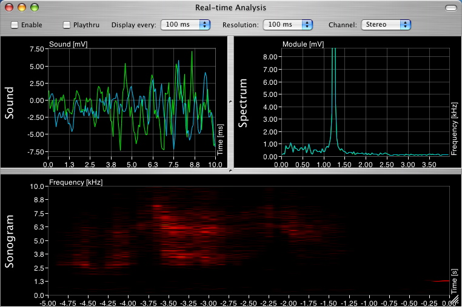

<canvas data-processing-sources="Klasse1/klang/web-export/klang2.pde"></canvas>

# Wissenschaft des Klangs

# Klang

Longitudinalwelle

## Frequenz
Frequenz

[wiki](http://de.wikipedia.org/wiki/Frequenz)

## Typische Wellenform von Synthesizer

## Periodendauer

## Amplitude

## Rauschen

## Oberton

## Experiment mit AudioXplorer

[AudioXplorer Webseite](http://www.arizona-software.ch/audioxplorer/)
