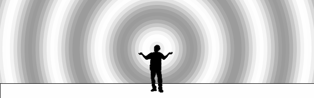
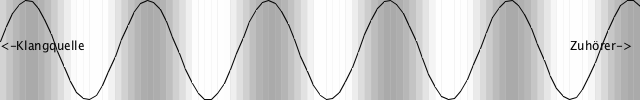
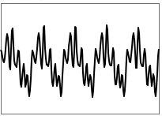
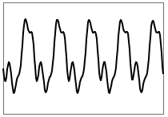
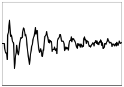
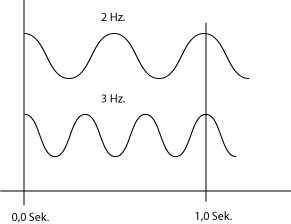

# Wissenschaft des Klangs

# Klang

- Grau ... Hoche Luftdichte = Hocher Druck
- Weiß ... Niedrige Luftdichte  = Niedriger Druck

**Wellenform (waveform)**

## Zwei Typen

### Klang (Pitched Tone)
Unter Klang versteht man in der Physik ein *periodisches* Schallereignis.

 Geige
 Gitarre

### Geräusch (Unpitched Tone)
Ursache für ein Geräusch sind Schwingungsvorgänge, die in der Regel *nicht periodisch verlaufen* und sich in ihrer Struktur zeitlich ändern können

 Snare Drum

### Experiment 1 / Klang aus Geräusch

[Audacity](http://audacity.sourceforge.net)
eine freie, plattformunabhängige Open-Source-Software für die Aufnahme und Bearbeitung von Audio.

- ein Geräusch aufnehmen.
- ein sehr kurzer Ausschnitt des Geräusches (0,005 msek)  wiederholen.
- wiedergeben

## Frequenz (frequency)
Wie schnell bei einem periodischen Vorgang die Wiederholungen aufeinander folgen. Einheit: **Hz.**

[wiki](http://de.wikipedia.org/wiki/Frequenz)

**Hörfläche**
Frequenzbereich von Schall, der vom menschlichen Gehör wahrgenommen werden kann, ungefähr von 20 bis 20,000 Hz.

### Tonleiter und Frequenz

| Helmholtz | International | Frequenz ( Hz.) |
|-----------|---------------|----------|
| A1        |A1             | 55       |
| A         |A2             | 110      |
| a         |A3             | 220      |
| a1        |A4             | 440      |
| a2        |A5             | 880      |
| a3        |A6             | 1760     |
| a4        |A7             | 3520     |

### Experiment 2 / Hörtest

[Pd Patch Herunterladen](exp2.pd)

## Periodendauer (wavelength)

Periodendauer = 1 / Frequenz

z.B.
400 Hz = 1/400 = 0,0025 sek. = 2.5 msek.

### Zeiteinheit

- 1 **Millisekunde** = 0,001 Sekunde
- 1 **Mikrosekunde** = 0,001 Millisekunde
- 1 **Nanosekunde** = 0,001 Mikrosekunde
- 1 Pikosekunde = 0,001 Nanosekunde

## Amplitude

## Phase

## Phasenauslöschung

## Wellenform

### Experiment 3

[Pd Patch Herunterladen](exp3.pd)

### Typische Wellenformen von Synthesizer
- **Sâgezahn (Sawtooth)**
- **Rechteck (Square)**
- **Sinus (Sine)**
- **Dreieck (Triangle)**

## Oberton

## Experiment mit AudioXplorer

[AudioXplorer Webseite](http://www.arizona-software.ch/audioxplorer/)

## Terminologien

1. Wellenform
- Frequenz
- Amplitude
- Periodendauer
- Millisekunde
- Mikrosekunde
- Nanosekunde
- Dreieck
- Rechteck
- Sinus
- Sâgezahn
- Hörfläche
- Klang
- Geräusch
- Phase
- Phasenauslöschung
- Zeitbereich
- Frequenzbereich
- Spektrum
- Spektrogramm
- Fourier Transform
- Oberton
- Obertonreihe
- Grundton/Grundfrequenz
- Unharmonische
