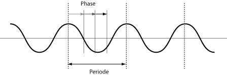

# Wissenschaft des Klangs

# Klang

- Grau ... Hoche Luftdichte = Hocher Druck
- Weiß ... Niedrige Luftdichte  = Niedriger Druck

**Wellenform (waveform)**

### Schallgeschwindigkeit
Die Schallgeschwindigkeit in trockener Luft von 20 °C ist **343** m/s.

- [Weißesrauschen 30 msek](Klasse1/30ms.wav)
- [Weißesrauschen 300 msek](Klasse1/300ms.wav)

## Zwei Typen

### Klang (Pitched Tone)
Unter Klang versteht man in der Physik ein *periodisches* Schallereignis.

 Gitarre

### Geräusch (Unpitched Tone)
Ursache für ein Geräusch sind Schwingungsvorgänge, die in der Regel *nicht periodisch verlaufen* und sich in ihrer Struktur zeitlich ändern können

 Snare Drum

### Experiment 1 / Klang aus Geräusch

- [Movie](http://youtu.be/9PJXH1XCv2s)

[Audacity](http://audacity.sourceforge.net)
eine freie, plattformunabhängige Open-Source-Software für die Aufnahme und Bearbeitung von Audio.

- ein Geräusch aufnehmen.
- ein sehr kurzer Ausschnitt des Geräusches (0,005 msek)  wiederholen.
- wiedergeben

## Frequenz (frequency)
Wie schnell bei einem periodischen Vorgang die Wiederholungen aufeinander folgen. Einheit: **Hz.**

[wiki](http://de.wikipedia.org/wiki/Frequenz)

**Hörfläche**
Frequenzbereich von Schall, der vom menschlichen Gehör wahrgenommen werden kann, ungefähr von 20 bis 20,000 Hz.

### Tonleiter und Frequenz

| Helmholtz | International | Frequenz ( Hz.) |
|-----------|---------------|----------|
| A1        |A1             | 55       |
| A         |A2             | 110      |
| a         |A3             | 220      |
| a1        |A4             | 440      |
| a2        |A5             | 880      |
| a3        |A6             | 1760     |
| a4        |A7             | 3520     |

### Experiment 2 / Hörtest

- [Movie](http://youtu.be/Vn9NiubJMcw)
- [Pd Patch Herunterladen](exp2.pd)

[Pure Data](http://puredata.info) ist eine datenstromorientierte Programmiersprache und Entwicklungsumgebung, die visuelle Programmierung benutzt. Sie wird vor allem zur Erstellung von interaktiver Multimedia-Software eingesetzt, etwa für Software-Synthesizer in der elektronischen Musik.

### Schwebung
die Resultierende der additiven Überlagerung zweier Schwingungen, die sich in ihrer Frequenz nur wenig voneinander unterscheiden, so dass es zu Interferenz kommt.

### Experiment 3 / Hörtest

- [Pd Patch Herunterladen](exp2.pd)

#### Musikalische Anwendung

- Alivin Lucier, Crossings (1984)
- [Crossings] (https://www.youtube.com/watch?v=JHkoZqmfwjI)

## Periodendauer (wavelength)
Periodendauer = 1 / Frequenz

z.B.
400 Hz = 1/400 = 0,0025 sek. = 2.5 msek.

### Zeiteinheit

- 1 **Millisekunde** = 0,001 Sekunde
- 1 **Mikrosekunde** = 0,001 Millisekunde
- 1 **Nanosekunde** = 0,001 Mikrosekunde
- 1 Pikosekunde = 0,001 Nanosekunde

## Amplitude
Die maximale Elongation einer Schwingung, von der Position der Null-Linie aus gemessen.

## Frequenz, Amplitude und unsere Wahrnehmung

## Phase
Die aktuelle Position im Ablauf eines periodischen Vorgangs.

### Phasenauslöschung

Eine Welle trifft auf eine andere Welle. Diese Wellen sind  gegensätzlich (Wellenberg trifft auf Wellental und umgekehrt), kommt es zur destruktiven Interferenz. Die Wellen verringert ihre Auslenkungen gegenseitig und im Extremfall kommt es zur Auslöschung.

### Experiment 4 / Phasenauslöschung

[Movie](http://youtu.be/rJWxxHmiPeA)

## Wellenform
die Wellenform bestimmt ihre Klangfarbe

 Geige

 Gitarre

 Klarinette

[Pd Patch Herunterladen](exp3.pd)

### Typische Wellenformen von Synthesizer
- **Sinus (Sinewave)**
- **Rechteck (Square)**
- **Dreieck (Triangle)**
- **Sägezahn (Sawtooth)**

#### Klnagbeispiele
- [Sinus](Klasse1/sinus.wav)
- [Rechteck](Klasse1/square.wav)
- [Dreieck](Klasse1/tri.wav)
- [Sägezahn](Klasse1/saw.wav)

ed/Vn9NiubJMcw" frameborder="0" allowfullscreen></iframe>

## Terminologien

1. Wellenform
- Schallgeschwindigkeit
- Frequenz
- Hz.
- Periodendauer
- Hörfläche
- Amplitude
- Millisekunde
- Mikrosekunde
- Nanosekunde
- Klang
- Geräusch
- Phase
- Phasenauslöschung
- Schwebung
- Dreieck
- Rechteck
- Sinus
- Sägezahn
