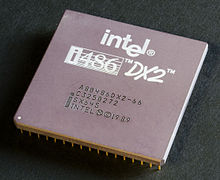
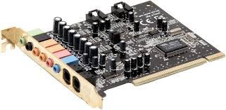

# Klasse 10

## Computer
Ein Computer ist ein Gerät, das mittels programmierbarer Rechenvorschriften Daten verarbeitet.

## Komponenten eines Computers

### Hauptplatine (Motherboard)
Die Hauptplatine ist die zentrale Platine eines Computers. Auf ihr sind die einzelnen Bauteile wie Hauptprozessor (CPU), Speicher, der BIOS-Chip mit der integrierten Firmware, Schnittstellen-Bausteine und Steckplätze für Erweiterungskarten montiert; die dafür notwendigen Leiterbahnen sind auf mehrere Lagen (Layer) aufgeteilt.

### CPU / Central Processing Unit
ist eine Maschine oder eine elektronische Schaltung, die gemäß übergebenen Befehlen andere Maschinen oder elektrische Schaltungen steuert und dabei einen Prozess oder Algorithmus vorantreibt, was meist Datenverarbeitung beinhaltet. Der weitere Artikel beschreibt ausschließlich diese Bedeutung.

z.B. Intel Core i7, Xeon, ARM A7

#### mooresche Gesetz
Das mooresche Gesetz (englisch Moore's law; deutsch „Gesetz“ im Sinne von „Gesetzmäßigkeit“) besagt, dass sich die Komplexität integrierter Schaltkreise mit minimalen Komponentenkosten regelmäßig verdoppelt; je nach Quelle werden 12 bis 24 Monate als Zeitraum genannt.

####  Taktfrequenz (Clock Rate)
Die Taktfrequenz ist die Frequenz, die aus der Systemuhr, der Clock, abgeleitet und für Synchronisation und Steuerung der Komponenten benutzt wird.

### Arbeitsspeicher (memory)
Bezeichnung für den Speicher, der die gerade auszuführenden Programme oder Programmteile und die [dabei] benötigten Daten enthält. Der Hauptspeicher ist eine Komponente der Zentraleinheit. Da der Prozessor unmittelbar auf den Hauptspeicher zugreift, beeinflussen dessen Leistungsfähigkeit und Größe in wesentlichem Maße die Leistungsfähigkeit der gesamten Rechenanlage.

Verglichen mit dem Arbeitsspeicher benötigt die Festplatte mit etwa 20 Millisekunden sehr lange, um die Daten bereitzustellen. Die Zugriffszeit auf den Arbeitsspeicher beträgt dagegen nur etwa 25 Nanosekunden, was einem Achthunderttausendstel davon entspricht.

### Festplatte (hard disk drive = HDD)
ist ein magnetisches Speichermedium der Computertechnik, bei welchem Daten auf die Oberfläche gekapselter rotierender Scheiben geschrieben werden. Zum Schreiben wird die hartmagnetische Beschichtung der Plattenoberfläche entsprechend der aufzuzeichnenden Information berührungslos magnetisiert. Durch die Remanenz erfolgt das Speichern der Information. Das Lesen der Information erfolgt durch berührungsloses Abtasten der Magnetisierung der Plattenoberfläche.

### Solid-State-Drive (solid state drive =SSD)
ist ein nichtflüchtiges elektronisches Speichermedium der Computertechnik. Die Bauform und die elektrischen Anschlüsse können, müssen aber nicht den Normen für Laufwerke mit magnetischen oder optischen Speicherplatten entsprechen. So können Solid-State-Drives auch als PCIe-Steckkarte ausgeführt sein. Die Bezeichnung „Drive“ weist daher lediglich auf die Verwendung als Ersatz für bisher übliche Festplatten hin: Es handelt sich nicht um Laufwerke im Wortsinn, bewegliche Teile sind nicht enthalten.

### Netzteil
Ein Netzteil dient zur Stromversorgung in Mikrocomputern. Der Netz-Wechselstrom wird darin in die im Computer benötigten niedrigeren Gleichspannungen transformiert, gleichgerichtet, gesiebt und geregelt. Beim PC ist es im Gehäuse des Computers eingebaut; Laptops und einige Miniatur-PCs haben externe Netzteile mit ähnlichen Eigenschaften.

### Soundkarte (Sound card)
Eine Soundkarte (auch Audiokarte, selten Tonkarte, engl. Sound Card), im eigenen Gehäuse auch Audio-Interface, ist derjenige Teil der Hardware eines Computersystems, welcher analoge und digitale Audiosignale verarbeitet. Zu den Aufgaben einer Soundkarte gehört die Aufzeichnung, die Synthese, Mischung, Bearbeitung und die Wiedergabe von Tonsignalen.

### Grafikkarte (Video card)
Eine Grafikkarte steuert in einem Computer die Grafikausgabe. Bei Ausführung eines Programms berechnet der Prozessor die Daten, leitet diese an die Grafikkarte weiter und die Grafikkarte wandelt die Daten so um, dass der Monitor oder Beamer alles als Bild wiedergeben kann. Grafikkarten werden entweder als PC-Erweiterungskarten (über die Bussysteme PCI, AGP oder PCI Express, früher auch ISA oder VLB) mit der Hauptplatine verbunden oder sind im Chipsatz auf der Hauptplatine enthalten. Mittlerweile ist die Integration soweit vorangeschritten, dass bereits in Hauptprozessoren Bestandteile für die Grafikausgabe vorhanden sind (bei Intel seit Core iX-Generation, bei AMD im Fusion-Programm).

### Optisches Laufwerk
Ein optisches Laufwerk ist ein Gerät zum Zugriff auf optische Datenträger z.B. CD-Laufwerk, DVD- Laufwerk, oder Blu-Ray Laufwerk.

### Computermonitor (Monitor)
Bei einem Computermonitor handelt es sich um ein Gerät, das einen Bildschirm zum Anschluss an einen Computer zur Verfügung stellt.

#### Bildauflösung
Die Bildauflösung ist ein umgangssprachliches Maß für die Bildgröße einer Rastergrafik. Sie wird durch die Gesamtzahl der Bildpunkte oder durch die Anzahl der Spalten (Breite) und Zeilen (Höhe) einer Rastergrafik angegeben.

## Software

### Betriebssystem (Operating System)
Ein Betriebssystem ist eine Zusammenstellung von Computerprogrammen, die die Systemressourcen eines Computers wie Arbeitsspeicher, Festplatten, Ein- und Ausgabegeräte verwaltet und diese Anwendungsprogrammen zur Verfügung stellt. Das Betriebssystem bildet dadurch die Schnittstelle zwischen den Hardwarekomponenten und der Anwendungssoftware des Benutzers.

z.B. Mac OS, Windows, Linux, Android, Chrome OS, iOS

####  Unix
ist ein Mehrbenutzer-Betriebssystem für Computer. Heute steht Unix allgemein für Betriebssysteme, die entweder ihren Ursprung im Unixsystem von AT&T (ursprünglich Bell Laboratories) haben oder dessen Konzepte implementieren. Es ist zusammen mit seinen Varianten und Weiterentwicklungen – oft unter anderen, in der Öffentlichkeit bekannteren Namen – eines der verbreitetsten und einflussreichsten Betriebssysteme der Computergeschichte. Bis in die 1990er Jahre wurde Unix hauptsächlich in spezialisierten Anwendungsbereichen wie etwa bei Workstations und Servern eingesetzt, insbesondere an Universitäten und Forschungseinrichtungen. Die heutige massenhafte Anwendung in fast allen Bereichen der Computertechnik begann erst ab etwa den 2000er Jahren.

Unix-Basiertes Betriebssystem: Mac OSX, Linux, Android, Chrome OS, iOS

### Grafische Oberfläche (Graphical User Interface = GUI)
 ist die Benutzerschnittstelle eines Computers über grafische Symbole bezeichnet. Sie ist eine Software-Komponente, die die Steuerung eines Computers durch Zeigegeräte wie eine Maus oder auch durch Fingerbewegungen direkt auf dem Schirm (Touchscreen) ermöglicht. Dadurch unterscheidet sich dieses Bedienkonzept grundsätzlich von der Kommandozeilen-Interaktion mit einem Computer.

Grafische Oberfläche von Windows

### Benchmark
Benchmarking bezeichnet die vergleichende Analyse von Ergebnissen oder Prozessen mit einem festgelegten Bezugswert oder Vergleichsprozess (von engl. Benchmark).

## Pionier der Computermusik

#### Max Mathews (1926-2011) / Der Vater der Computermusik
Max Mathews war ein US-amerikanischer Elektroingenieur und Pionier der Computermusik. 1957 spielte ein IBM 704-Computer eine 17 Sekunden lange Melodie, die sein Programm Music I erstellt hatte, das er an den Bell Laboratories entwickelt hatte. Dies gilt als Gründungsdatum der Computermusik.

- [Interview mit Max Mathews](http://blog.frieze.com/max-mathews/)

- [Silver Scale von Newman Guttman / Max Mathews](https://www.youtube.com/watch?v=PM64-lqYyZ8) Die erste Musik von Computer in der Menschheitsgeschichte

#### Lejaren Hiller (1924-1994) / Der Vater der algorithmischen Musik

Hiller interessierte sich zeitig für Musik nahm Kompositionsunterricht bei Harvey Officer und Oboenunterricht bei Joseph Marx. Er studierte dann bis 1947 Chemie an der Princeton University und parallel Musiktheorie und Komposition bei Milton Babbitt und Roger Sessions. Von 1946 bis 1952 arbeitete er in der Forschungsabteilung von DuPont in Waynesboro, Virginia, wo er das erste zuverlässige Verfahren zum Färben von Orlon entwickelte.

Ab 1952 unterrichtete Hiller an der Fakultät für Chemie der University of Illinois. Daneben setzte er seine musikalische Ausbildung bei Hubert Kessler fort. Er hatte an der Fakultät für Chemie Zugang zu Computern und experimentierte mit deren Einsatz bei der Komposition. So entstand 1957 als erste computergestützte Komposition seine ILLIAC Suite (String Quartet No. 4). 1958 wechselte er zur Fakultät für Musik und gründete dort ein Studio für experimentelle Musik.

- [ILLIAC Suite](https://www.youtube.com/watch?v=n0njBFLQSk8)

### Algorithmische Komposition
bezeichnet man jene Kompositionsverfahren, bei denen die Partitur durch einen automatischen, mathematisch beschreibbaren Prozess oder Algorithmus erzeugt wird.

Im Prinzip lässt sich jedes Musikstück als eine Folge von Zahlen darstellen: Ist es bei einem Instrument möglich, die Tonhöhe sowie die Anschlagsstärke und -dauer einer Note zu variieren, dann ist jede Note mit drei Zahlen darstellbar.

# Terminologien

1. Computer
2. CPU
3. Taktfrequenz
3. Arbeitsspeicher
4. Puffer
4. Festplatte
5. Solid-State-Drive
4. Hauptplatine
5. Grafikkarte
6. Optisches Laufwerk
7. Computermonitor
8. Bildauflösung
8. Soundkarte
9. Netzteil
10. Betriebssystem
12. Unix
19. Grafische Oberfläche
20. Benchmark
