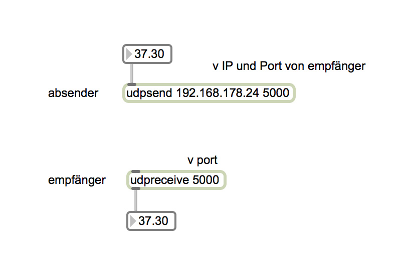

# Klasse 11
# Netzwerk

## IP-Adresse
Eine IP-Adresse ist eine Adresse in Computernetzen, die – wie das Internet – auf dem Internetprotokoll (IP) basiert. Sie wird Geräten zugewiesen, die an das Netz angebunden sind, und macht die Geräte so adressierbar und damit erreichbar. Die IP-Adresse kann einen einzelnen Empfänger oder eine Gruppe von Empfängern bezeichnen (Multicast, Broadcast). Umgekehrt können einem Computer mehrere IP-Adressen zugeordnet sein.

### IPv4
Die bekannteste Notation der heute geläufigen IPv4-Adressen besteht aus vier Zahlen, die Werte von 0 bis 255 annehmen können und mit einem Punkt getrennt werden, beispielsweise 192.0.2.42.

## MAC-Adresse
Die MAC-Adresse (Media-Access-Control-Adresse) ist die Hardware-Adresse jedes einzelnen Netzwerkadapters, die als eindeutiger Identifikator des Geräts in einem Rechnernetz dient.

Im Falle von Ethernet-Netzen besteht die MAC-Adresse aus 48 Bit (sechs Bytes). Die Adressen werden in der Regel hexadezimal geschrieben.

Üblich ist dabei eine byteweise Schreibweise, wobei die einzelnen Bytes durch Bindestriche oder Doppelpunkte voneinander getrennt werden, z. B. 00:80:41:ae:fd:7e

### Experiment 1

- Mit "Network Utility" prüfen Sie IP-Address und MAC-Address.

### Ping
ist ein Diagnose-Werkzeug, mit dem überprüft werden kann, ob ein bestimmter Host in einem IP-Netzwerk erreichbar ist. Daneben geben die meisten heutigen Implementierungen dieses Werkzeuges auch die Zeitspanne zwischen dem Aussenden eines Paketes zu diesem Host und dem Empfangen eines daraufhin unmittelbar zurückgeschickten Antwortpaketes an.

### LAN
 Ein Local Area Network, kurz LAN, ist ein Rechnernetz, das die Ausdehnung von Personal Area Networks übertrifft, die Ausdehnung von Metropolitan Area Networks, Wide Area Networks und Global Area Networks aber nicht erreicht. Ein LAN ist dabei in seiner Ausdehnung ohne Zusatzmaßnahmen auf 500 Meter beschränkt und wird in der Regel z. B. in Heimnetzen oder kleinen Unternehmen eingesetzt.

### WAN
Ein Wide Area Network (WAN, dt. Weitverkehrsnetz) ist ein Rechnernetz, das sich im Unterschied zu einem LAN  über einen sehr großen geografischen Bereich erstreckt.

Die Anzahl der angeschlossenen Rechner ist unbegrenzt. WANs erstrecken sich über Länder oder sogar Kontinente. WANs werden benutzt, um verschiedene LANs, aber auch einzelne Rechner miteinander zu vernetzen. Einige WANs gehören bestimmten Organisationen und werden ausschließlich von diesen genutzt. Andere WANs werden durch Internetdienstanbieter errichtet oder erweitert, um einen Zugang zum Internet anbieten zu können.

### Router
sind Netzwerkgeräte, die Netzwerkpakete zwischen mehreren Rechnernetzen weiterleiten können. Sie werden am häufigsten zur Internetanbindung, zur sicheren Kopplung mehrerer Standorte (Virtual Private Network) oder zur direkten Kopplung mehrerer lokaler Netzwerksegmente.

### NAT
Network Address Translation (NAT) ist in Rechnernetzen der Sammelbegriff für Verfahren, die automatisiert Adressinformationen in Datenpaketen durch andere ersetzen, um verschiedene Netze zu verbinden. Daher kommen sie typischerweise auf **Routern** zum Einsatz.

### DHCP
Das Dynamic Host Configuration Protocol (DHCP) ist ein Kommunikationsprotokoll in der Computertechnik. Es ermöglicht die Zuweisung der Netzwerkkonfiguration an Clients durch einen Server. Durch DHCP ist die automatische Einbindung eines Computers in ein bestehendes Netzwerk ohne dessen manuelle Konfiguration möglich. An diesem, dem Client, muss im Normalfall lediglich der automatische Bezug der IP-Adresse eingestellt sein. Beim Start des Rechners am Netz kann er die IP-Adresse, die Netzmaske, das Gateway und DNS-Server. Ohne DHCP sind dazu – abhängig vom Netzwerk, an das der Rechner angeschlossen werden soll – einige Einstellungen nötig.

### DNS (Domain Name Server)
DNS – Übersetzung von Rechnernamen in IP-Adressen
Über das weltweit verfügbare Domain Name System (DNS) können Namen in IP-Adressen (und umgekehrt) aufgelöst werden. Der Name www.example.com ergibt zum Beispiel die IPv4-Adresse 208.77.188.166, der Name www.ipv6.uni-muenster.de die IPv6-Adresse 2001:638:500:101:2e0:81ff:fe24:37c6.

### Experiment 2

- Mit "Network Utility" konvertieren Sie die URL von HFMT in IP-Addresse.
- Mit IP-Adresse die Webseite der HFMT zugreifen.

### Experiment 3
- Prüfen Sie die IP-Adress des Routers mit Google

## Port
Ein Port ist der Teil einer Netzwerk-Adresse, der die Zuordnung von TCP- und UDP-Verbindungen und -Datenpaketen zu Server- und Client-Programmen durch Betriebssysteme bewirkt. Zu jeder Verbindung dieser beiden Protokolle gehören zwei Ports, je einer auf Seiten des Clients und des Servers. Gültige Portnummern sind 1-65535.

Ports dienen zwei Zwecken:
- Primär sind Ports ein Merkmal zur Unterscheidung mehrerer Verbindungen zwischen demselben Paar von Endpunkten.
- Verbindungen zwischen demselben Paar von Endpunkten.
Ports können auch Netzwerkprotokolle und entsprechende Netzwerkdienste identifizieren.

[Liste von Port](http://en.wikipedia.org/wiki/List_of_TCP_and_UDP_port_numbers)

## TCP
Das Transmission Control Protocol ist ein Netzwerkprotokoll, das definiert auf welche Art und Weise Daten zwischen Computern ausgetauscht werden sollen. Nahezu sämtliche aktuellen Betriebssysteme moderner Computer beherrschen TCP und nutzen es für den Datenaustausch mit anderen Rechnern. Das Protokoll ist ein zuverlässiges, verbindungsorientiertes, paketvermitteltes Transportprotokoll in Computernetzwerken. Es ist Teil der Internetprotokollfamilie, der Grundlage des Internets.

## UDP
Das User Datagram Protocol, kurz UDP, ist ein minimales, verbindungsloses Netzwerkprotokoll, das zur Transportschicht der Internetprotokollfamilie gehört. Aufgabe von UDP ist es, Daten, die über das Internet übertragen werden, der richtigen Anwendung zukommen zu lassen. UDP ist ein verbindungsloses, nicht-zuverlässiges und ungesichertes wie auch ungeschütztes Übertragungsprotokoll. Das bedeutet, es gibt keine Garantie, dass ein einmal gesendetes Paket auch ankommt, dass Pakete in der gleichen Reihenfolge ankommen, in der sie gesendet wurden, oder dass ein Paket nur einmal beim Empfänger eintrifft.

|   | TCP  |  UDP |
|---|------|------|
|Sicherheit|besser|schlechter|
|Geschwindigkeit|langsamer|schneller|

## OpenSoundControl
Open Sound Control (OSC) ist ein nachrichtenbasiertes Kommunikationsprotokoll, welches hauptsächlich für die Echtzeitverarbeitung von Sound über Netze und Multimedia-Installationen verwendet wird. Steuersignale können von Hardware (z. B. MIDI-Keyboard) oder Software (z. B. Processing, Vvvv, Csound, Max/MSP, Pure Data, SuperCollider, ChucK, EyesWeb) erzeugt.

[OpenSoundControl](http://opensoundcontrol.org)

### Datentypen
- int32
- float32
- OSCString
- OSCTimetag

### OSC Message
Eine OSC-Message enthält zuerst eine Zeichenkette mit der Adresse des zu ändernden Parameters. z.B.

/synthesizer/zynaddsubfx/filter/lowpass 1

Danach folgt die Anzahl und Art der Parameter in einer Zeichenkette. Für zwei Float-Werte würde man "ff" angeben.

Dann folgen die einzelnen Werte für die Parameter. Will man an unserem imaginären Synthesizer z. B. die Resonanz von LP-Filter1 ändern, würde man senden:

/synthesizer/zynaddsubfx/filter/lowpass1/resonance "f" 1998.4f.

### Experiment 4
OSC Message-Sendung mit Max

## Terminologien

1. IP Address
2. IP v4
3. MAC Address
4. Ping
5. LAN
6. WAN
7. Router
8. DHCP
9. NAT
10. ping
11. DNS (Domain Name Server)
12. Switcher
13. LAN
14. WAN
15. NAT
16. DNS
17. PORT
18. TCP
19. UDP
20. OpenSoundControl
