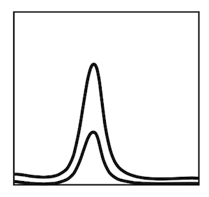
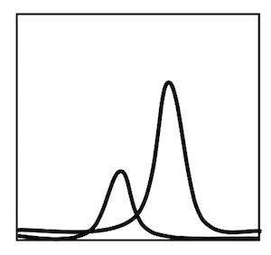

# Klasse 12

# Psychoakustik (Psychoacoustics)
　
## Gehörrichtige Lautstärke (Equal-loudness contour)
beschriebt wie Schallaufnahmen so wiedergegeben werden, dass sie bei unterschiedlichen Lautstärken einen ähnlichen Höreindruck ergeben.

Die Lautstärkewahrnehmung ist stark frequenzabhängig. Die Abhängigkeit der Lautstärkewahrnehmung von der Frequenz fällt darüber hinaus für unterschiedliche Lautstärkepegel unterschiedlich aus.

## Lautstärke
Die Lautstärke stellt der physikalisch messbaren Amplitude oder Stärke des Schalls, die vom Menschen wahrgenommene Lautheit als Lautheitsempfinden gegenüber.

## Bel/Dezibel (Bell/Decibel)
Das Bel ist eine Hilfsmaßeinheit zur Kennzeichnung von Pegeln. Das Bel dient zur Kennzeichnung des **dekadischen Logarithmus** des Verhältnisses zweier gleichartiger Energie. In der Regel wird statt des Bels das Dezibel (Einheitenzeichen *dB*) verwendet, also der zehnte Teil eines Bels.
Das dB allein ist eine reine Verhältnisangabe, ähnlich wie das Prozent (%). Es sagt also **nichts aus über absolute Größen**.

Das dB ist definiert als der zehnte Teil der dekadischen Logarithmus des zu messenden Verhältnisses x1/x2 :  10 * log(10) x1/x2

### Logarithmus

### Quiz

Beispiel:

B / A = 10

## Verdeckung (Masking )
bewirken beim menschlichen Gehör, dass der Mensch in einem Geräusch bestimmte Frequenzanteile nicht oder nur mit verringerter Sensitivität wahrnehmen kann.

### Simultane Verdeckung:
Ein Signal mit niedrigem Pegel wird durch ein zeitgleich auftretendes Signal mit hohem Pegel maskiert.

### Temporäre Verdeckung:
Ein Signal mit niedrigem Pegel wird durch ein Signal mit hohem Pegel, welches nach (bis 200ms) oder kurz vor (bis 50ms) dem schwachen Signal auftritt ebenfalls maskiert.

### Schalldruckpegel (Sound Pressure Level / SPL)
Der Bezugswert für Luftschall wurde Anfang des 20. Jahrhunderts festgelegt. Dieser Schalldruck wurde für die Hörschwelle des menschlichen Gehörs bei der Frequenz 1 kHz gehalten.

|Situation| dB  SPL|
|------------------|---------|
| Schmerzschwelle | 134 dB SPL |
| Gehörschäden bei kurzfristiger Einwirkung | 120 dB SPL	~ |
| Düsenflugzeug 100 m entfernt | 110–140 dB SPL	|
| 1 m entfernt / Diskothek	|	~ 100 dB SPL|
| Gehörschäden bei langfristiger Einwirkung	 | ab 85 dB	SPL|
| Hauptverkehrstrasse 10 m entfernt	| 	80–90 dB SPL|
| Pkw, 10 m entfernt	| 60–80 dB SPL|
| Fernseher in 1 m Zimmerlautstärke	| ca. 60 dB	SPL|
| Normale Unterhaltung, 1 m entfernt | 40–50 dB	SPL|
| Sehr ruhiges Zimmer	|	20–30 dB SPL|
| Blätterrauschen, ruhiges Atmen | 10 dB SPL |
| Hörschwelle | 0 dB SPL |

### Schallpegelmesser (Sound Level Meter)
Ein Schallpegelmesser ist ein Messgerät zur Bestimmung von Schalldruckpegeln. Sie zeigen Pegelwerte in Dezibel (dB SPL) an, verbunden mit der Angabe des Pegels; insbesondere werden Frequenz- und Zeitbewertung angezeigt. Schallpegelmesser finden dort Anwendung, wo eine Quantifizierung von Geräuschen notwendig ist, wie z. B. bei der Beurteilung von Fluglärm, Maschinenlärm, Umweltlärm und Lärm am Arbeitsplatz.

 an einem Flughafen

### Residualton (missing fundamental)
Residualton ist ein von F. J. Schouten eingeführter Begriff für ein psychoakustisches Phänomen. Bei der Präsentation eines akustischen Signals in Form einer periodischen Schwingung, bei der der Grundton nur sehr schwach oder gar nicht vorhanden ist, ergibt sich trotzdem eine Tonhöhenwahrnehmung, die diesem fehlenden Grundton entspricht. Auch von der Klangfarbe her wird das Fehlen des Grundtons oft weniger deutlich empfunden, als zu erwarten wäre. Diesen „hinzugefügten“ Grundton bezeichnet man als Residualton.

#### Experiment 3
Erzeugen Sie einen Resudualton mit Max

### Kombinationston (combination tone)
Kombinationstöne können bei gleichzeitigem Erklingen zweier unterschiedlicher Töne entstehen. Kombinationstöne treten besonders deutlich als Differenzfrequenz. Geschulte Musiker hören weitere Kombinationstöne als Differenzen und Summen der Vielfachen der Frequenzen. 

#### Experiment 4
Erzeugen Sie einen Kombinationston mit Max

#### Links
[Auditive Wahrnehmung und kritische Bandbreiten](http://www.netaudio.de/psychoakustik/Daten/startseite.htm)

1. Psychoakustik (Psychoacoustics)
2. Gehörrichtige Lautstärke (Equal-loudness contour)
3. Bel (Bell)  
4. Dezibel (Decibel)
5. Verdeckung (Masking)
6. Simultane Verdeckung (simultaneous Masking)
7. Temporäre Verdeckung (temporal Masking)
8. Schalldruckpegel (Sound Pressur Level)
9. Schallpegelmesser
