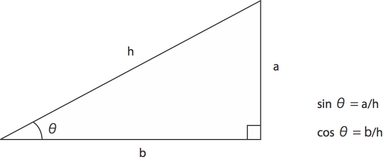
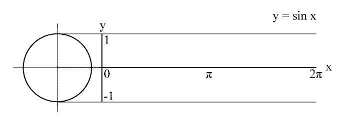
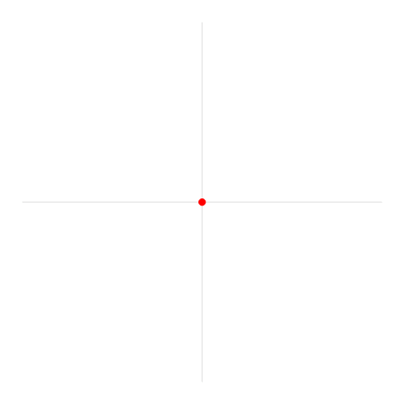

# Klasse2 Wissenschaft des Klangs

## Funktion
In der Mathematik ist eine Funktion eine Beziehung zwischen zwei Mengen, die jedem Element der einen Menge x-Wert) genau ein Element der anderen Menge (y-Wert) zuordnet.

z.B. eine quadratische Funktion

## Expriment 1

- mehrere Funktionen mit GeoGebra zeichnen

### Software für Funktionsgraph
- [GeoGebra](http://www.geogebra.org)

## Sinus

Warum ist diese Welle "Sinus" genannt?

Sinuswelle kan man mit Sinusfunktion generieren.

y = sin(x)

### Trigonometrie

[wikipedia](http://de.wikipedia.org/wiki/Trigonometrie)

### Radiant
Der Radiant (Einheitenzeichen: **rad**) dient zur Angabe der Größe eines ebenen Winkels. Der Winkel in Radiant ist die Länge eines Kreisbogens geteilt durch den Radius des Kreises. Der Winkel von 1 Radiant schneidet also aus der Umfangslinie eines Kreises mit 1 Meter Radius einen Bogen der Länge 1 Meter heraus. Da der Vollkreis (360°) den Umfang, also die Bogenlänge, von 2PI r hat, beträgt der Vollwinkel 2PI rad.

### Quiz

1. sin(0.5 PI)
2. cos(0.5 PI)
3. sin(2 PI)
4. cos(0.75 PI)
5. sin(1.75 PI)

### Sinus und Kosinus
90 Grad (0,5 PI rad) Phasenverschiebung.

## Das Problem der Wellenform

[Samples](samples.zip)

was kann man beobachten?

## Joseph Fourier (1768-1830)
[wikipedia](http://de.wikipedia.org/wiki/Joseph_Fourier)

ein französischer Mathematiker und Physiker. Mit der Fourieranalyse legte er einen Grundstein für den Fortschritt der modernen Physik und Technik.

[wikipedia](http://de.wikipedia.org/wiki/Fourier-Transformation)

Er entdeckte:
ein periodisches Signal lässt sich durch Überlagerung von **sinus- bzw. kosinusförmigen Teilschwingungen** unterschiedlicher Frequenz und Amplitude erzeugen.

### Fourier-Transformation
Die Fourier-Transformation ist eine Methode, die es erlaubt, kontinuierliche **Signale** in ein kontinuierliches **Spektrum** zu zerlegen.

## Spektrum

- x = Frequenz
- y = Amplitude

## Experimente 1 / AudioXplorer

- Analysiere Spektren von verschiedenen Klängen mit AudioXPlorer

## Spektren von Instrumenten
### Geige

### Gitarre

### Klarinette

- [Klangdateien](Klasse2/instrument_samples.zip)

## Grundton (Grundfrequenz)
Grundton ist die tiefste (unterste) Frequenz in einem harmonischen Frequenzgemisch bezeichnet. Unter Frequenz versteht man die Anzahl von Schwingungen pro Zeit. Die Grundfrequenz beschreibt, wie häufig eine solche Muster-Wiederholung stattfindet.

## Oberton
Obertöne sind Sinustöne, die zu einem (ebenfalls sinusförmigen) Grundton hinzutreten, um sich mit ihm zu einem Schallereignis zu verbinden.

## Experiment 2 / Additive Synthese

- Analysiere das folgende Spektrum von Klarinette
- Imitiere das Spektrum mit mehreren Sinus.

- [Klangdatei Klarinette 200Hz](Klasse2/clarinet_200Hz.wav)

|Oberton|Frequenz|Amplitude|
|----|-----|---|
|1	 |200	 |7  |
|2	 |400	 |0  |
|3	 |600	 |6  |
|4	 |800	 |0.3|
|5	 |1000 |3.5|
|6	 |1200 |0.2|
|7	 |1400 |0.5|

### Additive Synthese
Bei der additiven Synthese werden einzelne Klänge durch die Addition verschiedener Sinuswellen erzeugt.

## Spektrum von Sinus und Geräusch
### Sinus

### Geräusch

## Spektrum von Glocke

## Experiment 4 / Metallische Stimme

- Unsere Stimme ist ein harmonischer Klang
- mit Spektralverschiebung kann man die Obertöne der Stimme vershieben

### SPEAR
[Spear Webseite](http://www.klingbeil.com/spear/)

## Spektrogramm

- x: Zeit
- y: Frequenz
- Farbe: Amplitude

# Terminologien
1. Funktion
2. Trigonometrische Funktion
3. Radiant
4. Sinus
5. Kosinus
6. Joseph Fourier
7. Fourier-Transformation
8. Spektrum
9. Frequenzbereich
10. Zeitbereich
11. Spektrogramm
12. Grundton
13. Oberton
14. Additive Synthese
15. Unharmonisch
16. Spektralverschiebung

# HA

Nehmen Sie drei unterschiedlich Klänge mit AudioXPlorer auf, spiechern Sie als AudioXPlorer Dateien und schicken Sie an mich.
Die Aufnahme muss kurzer als 5 Sekunde sein.

[Anweisung auf Youtube](http://youtu.be/I3ngAZOZwuI)
