#Klasse3

**"Computer versteht nur Zahlen"**

## Ascii (American Standard Code for Information Interchange)
ist eine 7-Bit-Zeichenkodierung.
Die Zeichenkodierung definiert 128 Zeichen, bestehend aus 33 nicht druckbaren sowie 95 druckbaren Zeichen.
Die druckbaren Zeichen umfassen das lateinische Alphabet in Groß- und Kleinschreibung, die zehn arabischen Ziffern sowie einige Satzzeichen.

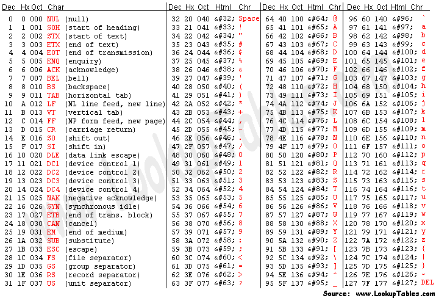

z.B.
Chikashi = 12 104 105 107 97 115 104 105

### Experiment 1

"key" Objekt in Max gibt eine Ascii-Nummer aus, wenn man eine Taste drückt.

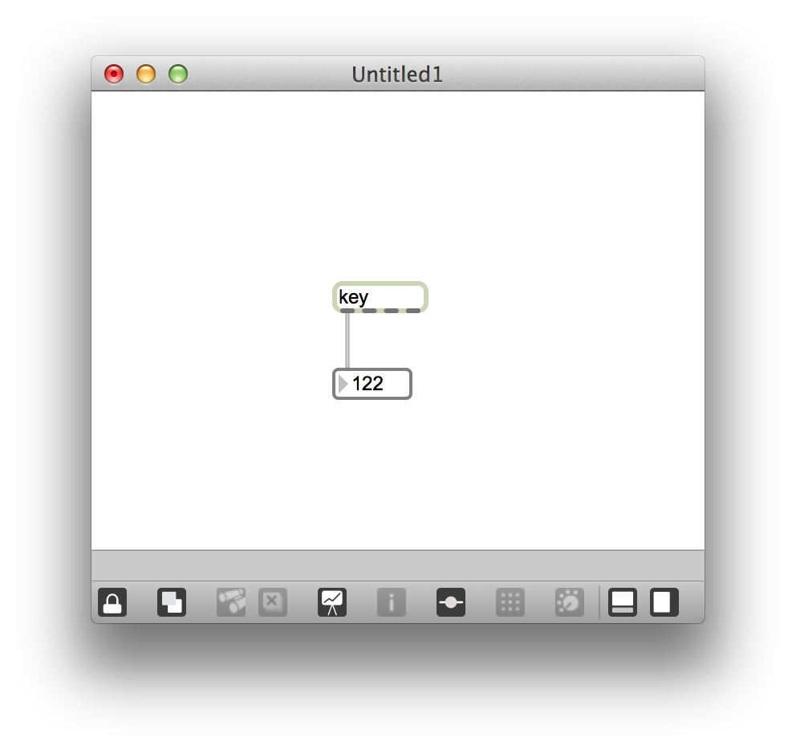

## Pixel
Mit Pixel werden die einzelnen Farbwerte einer digitalen Rastergrafik bezeichnet sowie die zur Erfassung oder Darstellung eines Farbwerts nötigen Flächenelemente bei einem Bildsensor beziehungsweise Bildschirm mit Rasteransteuerung.

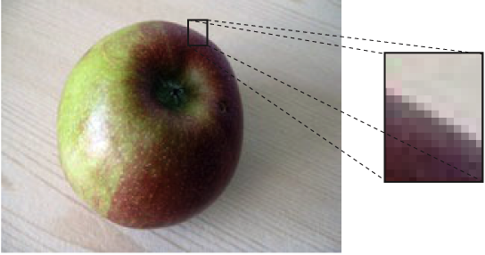

### RGB-Farbraum
Ein RGB-Farbraum ist ein additiver Farbraum, der Farbwahrnehmungen durch das additive Mischen dreier Grundfarben (Rot, Grün und Blau) nachbildet.

### Experiment 2

Man kann die Farbe mancher Objekten in Max mit "RGB Slider" ändern.

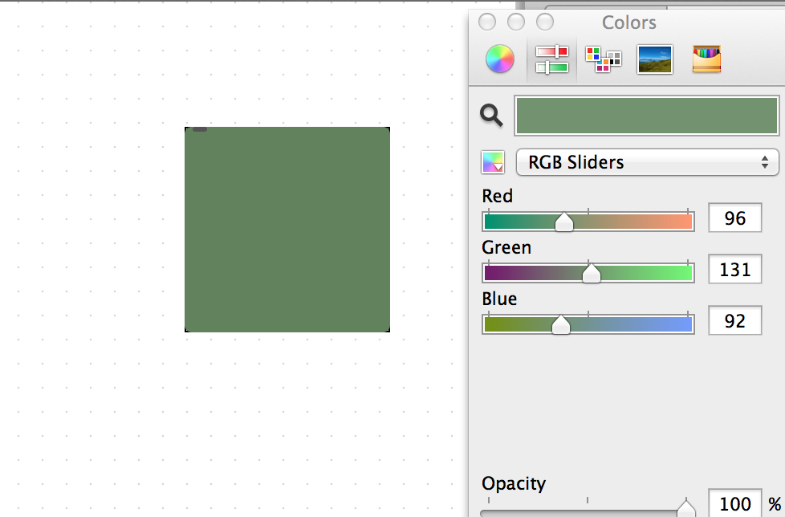

## Klang und Zahlen

**"Digitalisierung ist ein Art von Informationsreduktion"**

### Abtastung (Sampling)
Unter Abtastung wird in der Signalverarbeitung die Registrierung von Messwerten zu diskreten, meist äquidistanten Zeitpunkten verstanden. Aus einem zeitkontinuierlichen Signal wird so ein zeitdiskretes Signal gewonnen.

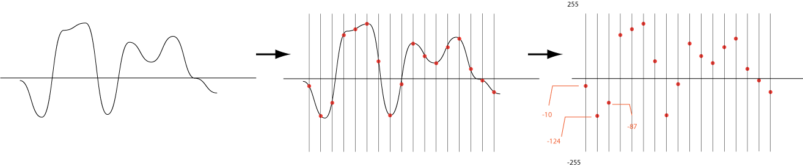

### Digitalsignal
Ein Digitalsignal ist eine spezielle Form eines Signals, welches einerseits einen abgegrenzten und gestuften Wertvorrat und zudem in der zeitlichen Abfolge nur zu bestimmten periodischen Zeitpunkten definiert ist bzw. eine Veränderung im Signalwert aufweist. Es kann aus einem Analogsignal, welches den zeitlich kontinuierlichen Verlauf einer physikalischen Größe beschreibt, durch die **Quantisierung** und eine **Abtastung**, welche zu definierten Zeitpunkten erfolgt, gebildet werden. Die digitalen Werte sind üblicherweise als **Binärzahlen** kodiert, so dass ihre Quantisierung in Bits angegeben wird.

#### zeidiskretes Signal / zeitkontinuierliches Signal
Ein zeitdiskretes Signal ist eine spezielle Form eines Signals, das nur zu bestimmten, üblicherweise periodischen, Zeitpunkten definiert ist.

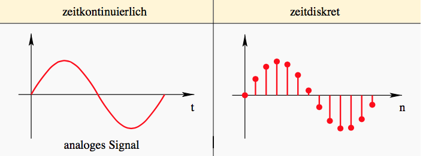

- Digitalsignal = zeitdiskretes Signal
- Analogsignal = zeitkontinuierliches Signal

## Abtastrate (Sampling Rate)
 ist in der Signalverarbeitung die Häufigkeit, mit der ein kontinuierliches Signal in einer vorgegebenen Zeit abgetastet und in ein zeitdiskretes Signal umgewandelt wird.

### Experiment 3

Mit "capture~" kann man die Abtastwerte anzeigen.

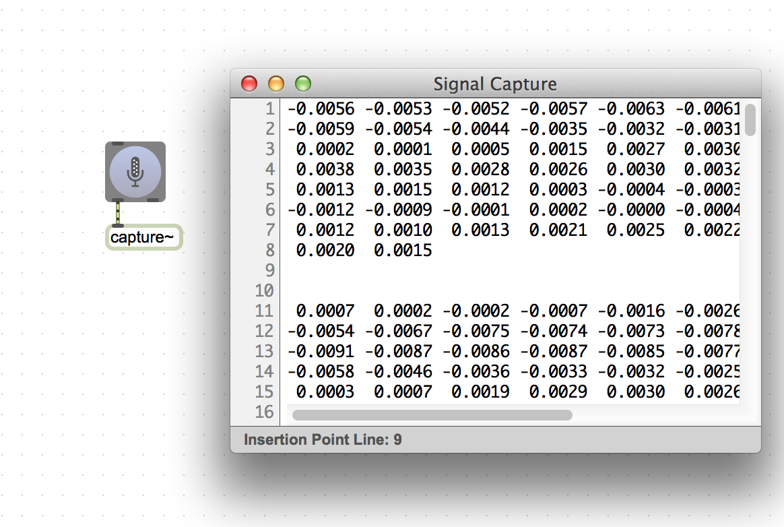

### Abtastrate von CD, DAT und DVD-Audio

- Abtastrate von CD: 44100 Hz.
- DAT (Digital Audio Tape): 48000 Hz.
- DVD Audio: von 96000 Hz bis 192000 Hz.

## Nyquist-Frequenz
Die Nyquist-Frequenz definiert als die **halbe Abtastrate**.
Nach dem  Nyquist-Shannon-Abtasttheorem müssen alle Anteile in einem Signal kleinere Frequenzen als die Nyquist-Frequenz haben, damit das abgetastete Signal rekonstruiert werden kann.

z.B. CD = Abtastrate 44100 Hz = Nyqyust-Frequnez 22050 Hz.

## Aliasing
Aliasing ist Signalanalyse Fehler, die auftreten, wenn im abzutastenden Signal Frequenzanteile vorkommen, die höher als die Nyquist-Frequenz (halbe Abtastfrequenz) sind.

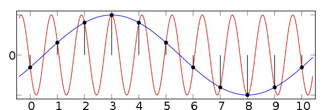

Aliasing kann einerseits durch die Nichtbeachtung des Abtasttheorems (zu geringe Abtastfrequenz) beim digitalen Abtasten von Signalen auftreten und andererseits, wenn das abzutastende Signal von einem Störsignal überlagert ist, das seinerseits Frequenzen enthält, die höher als die Nyquist-Frequenz sind.

### Experiment 4

- Aliasing-Experiment in Max

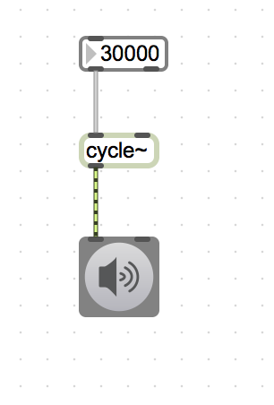

## Heruntertaktung (Downsampling)
bezeichnet die Reduktion der Stützstellen einer Zeitreihe  diskreter Werte.

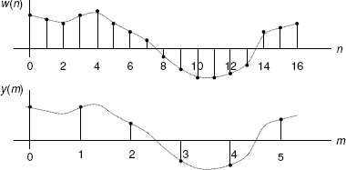

## ADC/ DAC

- ADC = Analog to Digital Converter
ist ein elektronisches Gerät oder Bauteil zur Umsetzung analoger Eingangssignale in digitale Daten der dann weiterverarbeitet oder gespeichert werden kann.

- DAC = Digital to Analog Converter
wird verwendet, um digitale Signale oder einzelne Werte in analoge Signale umzusetzen.

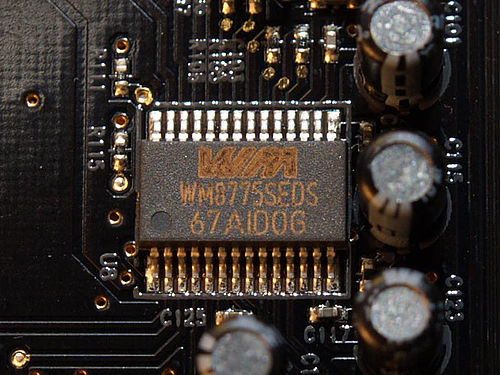

## Hauaufgabe (Heruntertaktung)

1. Nehmen Sie einen 1 sekundigen Klang auf.
2. Takten Sie mit "resampling" den aufgenommenen Klang herunter.
3. Speichern Sie den Original Klang und zwei heruntetaktete Klänge ( SR=6000 Hz , 1000 Hz);
4. Schicken Sie diese drei Klangdateien (bzw. SR = 44100 Hz, 6000 Hz, 1000 Hz) an mich [me(at)chikashi.net]

[Anweisung auf Youtube](https://www.youtube.com/watch?v=zzDMfk1s-Yc&feature=youtu.be)

## Terminologien

1. Ascii 
2. Pixel
3. Digitalsignal
4. Zeitdiskretes Signal
5. Zeitkontinuierliches Signal
6. Abtastung (Sampling)
7. Abtastrate (Sampling Rate)
8. Abtastrate von CD
9. Nyquist-Frequenz
10. Aliasing
11. Quantisierung
12. Heruntertaktung (Downsampling)
13. ADC
14. DAC　
15. Digitale Signalverarbeitung (Digital Signal Processing)
