#Klasse 4

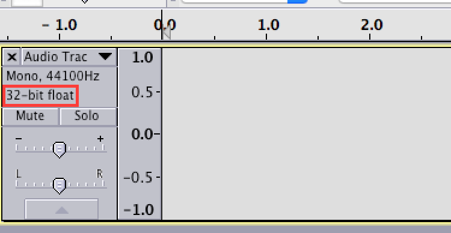

32-bit float?

## Binärsystem
ist ein Zahlensystem, das zur Darstellung von Zahlen nur zwei verschiedene Ziffern benutzt.
Im üblichen Dezimalsystem werden die Ziffern 0 bis 9 verwendet. Im Dualsystem hingegen werden Zahlen nur mit den Ziffern des Wertes Null und Eins dargestellt. Oft werden für diese Ziffern die Symbole 0 und 1 verwendet.

## Dezimalsystem
ist ein Zahlensystem, das als Basis die Zahl 10 verwendet.

[Das Binärsystem](http://www.arndt-bruenner.de/mathe/Allgemein/binaersystem.htm)

## Quiz 1

Konvertieren Sie die folgende Bainäre Zahlen auf Dezimal
1. 10
2. 101
3. 1001
4. 10111
5. 111110
6. 11111111

## Quiz 2

Berechnen Sie den maximalen Wert (Anzahl der Zusätnde) mit folgender Anzahl von bits.

1. 7 bits
2. 4 bits
3. 16 bits
4. 24 bits
5. 32 bits

## Bit
1 bit ist der Informationsgehalt, der in einer Auswahl aus zwei gleich wahrscheinlichen Möglichkeiten enthalten ist.

## Nibble
Ein Nibble ist eine Datenmenge, die 4 Bits umfasst, es wird auch Halbbyte genannt.

## Byte

ist eine Maßeinheit, das für eine Folge von **8 Bit** steht.
mit 1 Byte kann mann 256 (2 hoch 8) Zustände darstellen.

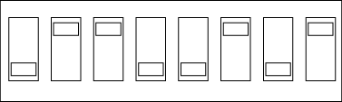

## KB, MG, GB, TB
- kilo byte (KB) = 1024 Bytes
- mega byte (MB) = 1024 KB
- giga byte (GB) = 1024 MB
- tera byte (TB) = 1024 GB

## Quantisierung (Quantization)
Ein Audiosignal im Moment der Abtastung werden über einen ADC in einen Zahlenwert umgewandelt. Dabei wird auf ganze Zahlen gerundet.

## Bittiefe (Bit depth)
gibt die Anzahl der Bits an, die bei der Digitalisierung eines analogen Signals pro Abtastwert (=Sample) verwendet werden. Sie bestimmt also, in wie vielen Abstufungen die analoge Amplitude digital repräsentiert werden kann. Sie ist neben der Abtastrate der zweite Parameter, durch den ein Digitalisierungsvorgang beschrieben wird.

## Quantisierungsstufe
Die Anzahl der Quantisierungsstufen beschreibt die Auflösung des vorhandenen Wertebereiches bei der Wandlung eines analogen Signals in ein digitales (vergleiche Quantisierung ). Je mehr Quantisierungsstufen verwendet werden desto feiner wird die Amplitude des zu wandelnden Signals erfasst.

---

8 bits = 0~255 = -128~127
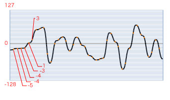

---

4 bits = 0~15 = -8~7
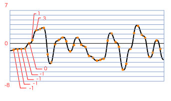

---

## Quantisierungsfehler (Quantization Error)
Der Quantisierungsfehler ist der Fehler, der bei der Quantisierung von analogen Größen entsteht (z. B. bei der Analog-Digital-Umsetzung). Während analoge Signale dem Wertebereich der reellen Zahlen genügen, werden in der digitalen Darstellung nur diskrete Werte verwendet. Daher ist mit der Quantisierung eine Rundung verbunden, die einen Fehler verursacht.

### ein musikalische Beispiel von Quantisierungsfehler

[Atari Teenage Riot - Digital HardCore - ](https://www.youtube.com/watch?v=ucGaSJmUZi0&list=RDShiCv4RZdWU&index=6)

### Bittiefe von CD, MD und DVD

- CD = 16 bits
- MD(Mini Disc) = 24 bits
- DVD Audio / Blu-ray = 24 bits

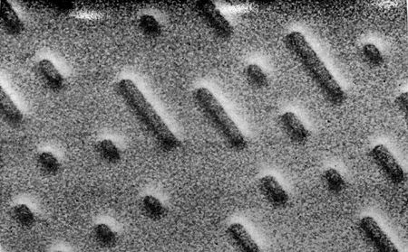

## Experiment 1

- Verarbeiten Sie mit degrade~ verschiedene Klänge.

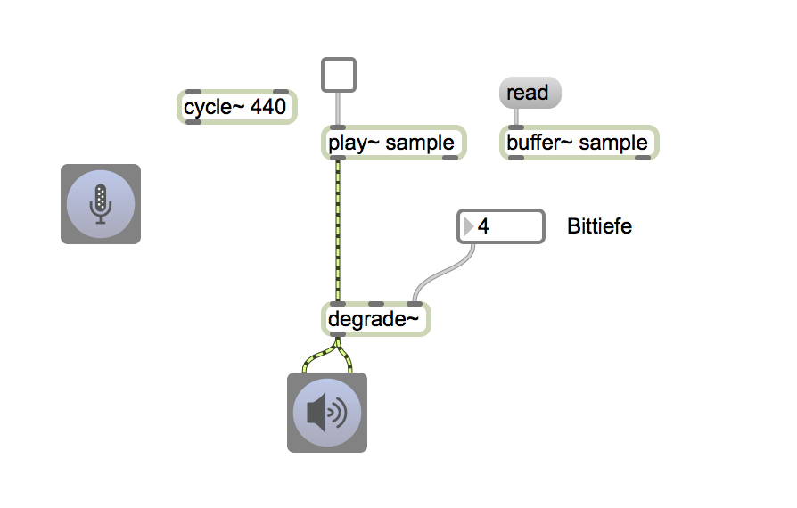

## Experiment 2
(Der Grund warum  Gameboy nur Rechteck benuzt)

- Mit degrade~ die Bittiefe von Sägezahn, Sinus, Saw und Rechteck verändern.
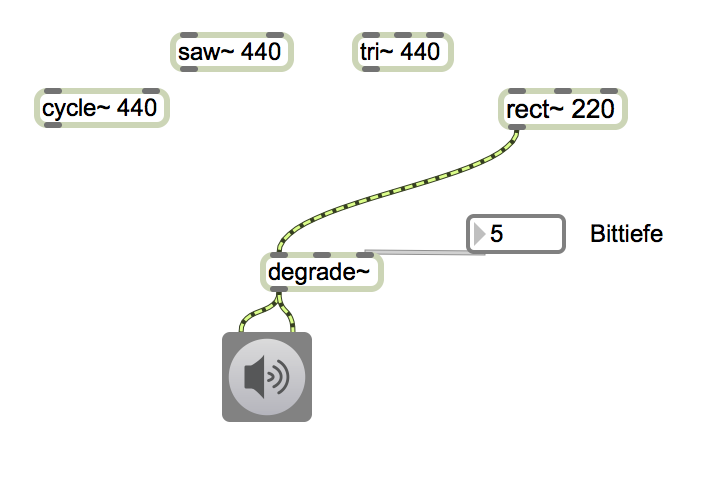

## Abtastrate + Quntisierung Matrix

| Bit depth / SR  |  	8kHz                       | 44.1kHz                            | 	48kHz                           | 96kHz                           |
|-----------------|------------------------------|------------------------------------|-----------------------------------|---------------------------------|
| 8 bit	          |[960KB](Klasse4/8kHz8bit.wav) |	[5.2MB](Klasse4/44.1kHz8bit.wav)  | [5.6MB](Klasse4/48kHz8bit.wav)    | [11.2MB](Klasse4/96kHz8bit.wav) |
| 16 bit          |[1.9MB](Klasse4/8kHz16bit.wav)| [10.3MB](Klasse4/44.1kHz16bit.wav) | [11.2MB](Klasse4/48kHz16bit.wav)  | [22.5MB](Klasse4/96kHz16bit.wav)|
| 24 bit          |[2.8MB](Klasse4/8kHz24bit.wav)| [15.5MB](Klasse4/44.1kHz24bit.wav) | [16.9MB](Klasse4/48kHz24bit.wav)  |[33.8MB](Klasse4/96kHz24bit.wav) |

## Formate der Audiodateien (Sound files)

- Drei Typen
  - keine Datenkompression (uncompressed)
  - verlustbehaftete Kompression (lossy compression)
  - verlustfreie Kompression (lossless compression)

### Keine Datenkompression
####AIFF
- Audio Interchange File Format
- Entwickelt von: Apple
- keine Datenkompression
- [Klangbeispiel 10.8MB](Klasse4/44.1kHz16bit.aiff)

####WAV
- Entwickelt von: Microsoft und IBM
- keine Datenkompression
- [Klangbeispiel 10.8MB](Klasse4/44.1kHz16bit.wav)

### Verlustbehaftete Kompression
####MP3
- MPEG 1 Layer III
- Entwickelt von: Fraunhofer Institute
- verlustbehafteten Kompression (lossy compression)
- MP3 bedient sich dabei der Psychoakustik mit dem Ziel, nur für den Menschen wahrnehmbare Signalanteile zu speichern. Dadurch wird bei nicht oder nur kaum verringerter wahrgenommener Audioqualität eine starke Reduktion der Datenmenge möglich
- [Klangbeispiel 986KB](Klasse4/44.1kHz16bit.mp3)

####AAC
- Advanced Audio Codec
- Entwickelt von: Bell Labs, Fraunhofer Institute, Dolby Labs, Sony and Nokia
- verlustbehafteten Kompression (lossy compression)
- Bei geringerer Komplexität als MP3 sind bei gleicher Datenrate bessere Qualitäten erreichbar
- [Klangbeispiel 2MB](Klasse4/44.1kHz16bit.m4a)

### Verlustfreie Kompression
####FLAC
- Free Lossless Audio Codec
- Entwickelt von: Org Foundation
- verlustfreie Kompression
- Open Source
- [Klangbeispiel 3.9MB](Klasse4/44.1kHz16bit.flac)

#### Apple lossless

- Entwickelt von: Apple
- verlustfreie Kompression
- [Klangbeispiel 3.8MB](Klasse4/44.1kHz16bit_lossless.m4a)

## Audio-Interface
**"Das Audiointerface bildet das Herzstück eines modernen Tonstudios"**

Laptop und Audio - Stereo Eingänge + Stereo Ausgänge
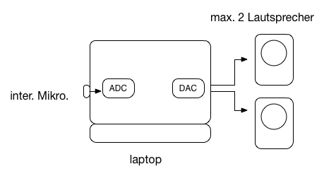

---

- Wie kann man ein Mikrofon und einen Laptop anschließen?
- Wie kann man mehr als 2 Lautsprecher anschließen?
- Wie kann man die Qualität des aufgenommen Klangs verbessern?

=> Die Lösung: **Audio Interface**

mit Audio-Interface - Viele Eingänge + Viele Ausgänge
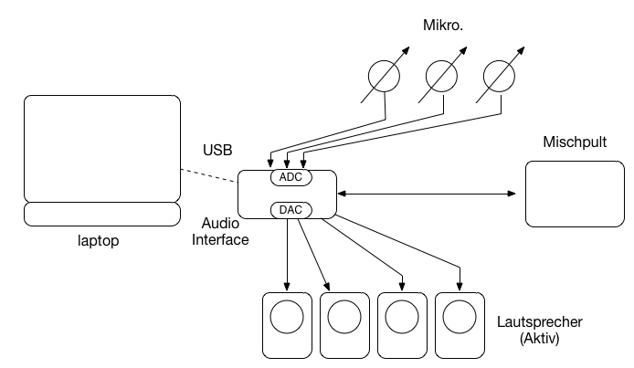

- Hersteller von Audio-Interfaces
  - [MOTU](http://www.motu.com/products) USA
  - [RME](http://www.rme-audio.de/en_index.php) Deutschland
  - [avid](http://www.avid.com/US/resources/digi-orientation) USA
  - [Roland](http://www.roland.com/products/en/) Japan
  - [Apogee](http://www.apogeedigital.com) USA

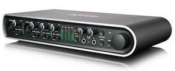
Avid Mbox

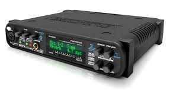
Motu UltraLite3

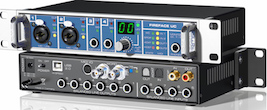
Fireface UC

### USB (Universal Serial Bus)
Zurzeit haben meiste Audio-Interfaces einen USB Anschluss.

#### USB Kabel
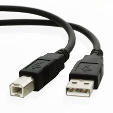

### Wie sollen wir **gute Audioqualität** definieren?

Ein Paar Kriterien:

#### Signal-Rausch-Verhältnis (S/N Ratio)
ist ein Maß für die technische Qualität eines Nutzsignals (z. B. Sprache ), das von einem Rauschsignal überlagert ist. Es ist definiert als das Verhältnis der mittleren Leistung des Nutzsignals zur mittleren Rauschleistung des Störsignals.

#### Dynamikumfang (Dynamic Range)
In der Tontechnik gibt der Dynamikumfang eines Audiosystems den Bereich an, in dem sich der Pegel des Tonsignals nutzbringend bewegen kann, sei es für Aufzeichnung, Sendung oder Wiedergabe. Dieser Wert wird meistens in dB angegeben.

#### Frequenzgang (Frequency Response)
Der Frequenzgang ist ein Maß für das Verhältnis der Pegelabweichungen zueinander. Im Audiobereich würden sich Frequenzgangabweichungen durch eine stärkere oder geringere Dämpfung einzelner Frequenzen bemerkbar machen.

## Terminologien

1. bit
2. Binärsystem
3. Dezimalsystem
4. byte
5. nibble
6. kilobyte
7. megabyte
8. gigabyte
9. terabyte
10. Quantisierung
11. Bittiefe
12. Quantisierungsstufe
13. Quantisierungsfehler
14. AIFF
15. WAV
15. MP3
15. AAC
16. FLAC
17. Apple lossless
14. Audio Interface
15. USB / USB Kabel
16. Signal-Rausch-Verhältnis (S/N Ratio)
17. Dynamikumfang (Dynamic Range)
18. Frequenzgang (Frequency Response)
