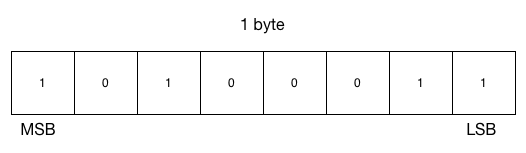

#Klasse 5

## MIDI ( Musical Instrument Digital Interface )
ist ein **Industriestandard** für den Austausch musikalischer Steuerinformationen zwischen elektronischen Instrumenten, wie z. B. Keyboards oder Synthesizern. Dieser Standard umfasst sowohl die genaue Beschaffenheit der erforderlichen Hardware als auch das Protokoll für die übermittelnden Daten. MIDI 1.0 wurde im August 1982 eingeführt.

Webseite : [http://www.midi.org/index.php](http://www.midi.org/index.php)

## Hintergrund

## Experiment 1

- Schlissen Sie eine MIDI Tastatur und den Computer an.
- Programmieren Sie das obenstehende Patch
- "midiin" Objekt gibt "raw MIDI messages" aus
- Drücken Sie die Taste und beobachten Sie die MIDI Messages

## MIDI Message

- Status Byte (zwischen 128 und 255)
- Data Byte 1 (zwischen 0 und 127)
- Data Byte 2 (zwischen 0 und 127)

## MSB LSB

- MSB - most significant bit
- LSB - least significant bit

## General MIDI
standardisiert weit mehr als der generelle MIDI-Standard. Ist dieser mehr oder weniger eine Hardware- und Protokoll-Spezifikation, legt General-MIDI auch Inhalte fest. GM setzt dabei einen Mindeststandard für die Belegung der Instrumente auf den 128 Programmplätzen. Nach GM muss ein kompatibler Klangerzeuger 24 Klänge gleichzeitig erzeugen können. Ferner sind nach GM weitere Steuerungsparameter definiert, wie z. B. die Effektsteuerung.

- [General MIDI SoundSet](http://www.midi.org/techspecs/gm1sound.php)

## Standard MIDI File

## MIDI Kabel

## Software Synthesizer
Ein Software-Synthesizer oder Softsynth ist ein Computerprogramm, das einen Hardware-Synthesizer digital nachstellt (simuliert) oder sich davon inspirieren lässt. Mitte der 1990er Jahre wurden Personal Computer leistungsfähig genug, um Software-Synthesizer verzögerungsfrei über eine MIDI-Tastatur spielbar zu machen. Das sorgte für eine große Popularität solcher Programme. Sie ersetzen und ergänzen seitdem zunehmend die wesentlich teureren und häufig schwergewichtigen Hardware-Synthesizer auch in großen Tonstudios.

- VST
- AU
- RTAS

## Terminologien

1. MIDI
2. MIDI Message
3. Status Byte
4. Data Byte
3. MSB LSB
4. MIDI Note on Message
5. MIDI Note off message
6. MIDI Program Change
7. MIDI Sequencer
8. Master Keyboard
9. Control Number / Control Value
4. General MIDI
5. Standard MIDI File
6. MIDI Kabel
7. Software Synthesizer
8. VST  (Virtual Studio Technology)
9. AU ( Audio Unit )
10. RTAS
