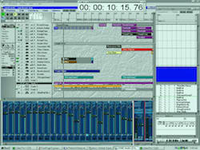
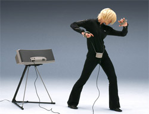
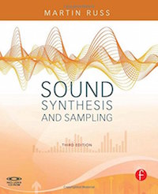

#Klasse 5

## MIDI ( Musical Instrument Digital Interface )
ist ein **Industriestandard** für den Austausch musikalischer Steuerinformationen zwischen elektronischen Instrumenten, wie z. B. Keyboards oder Synthesizern. Dieser Standard umfasst sowohl die genaue Beschaffenheit der erforderlichen Hardware als auch das **Protokoll** für die übermittelnden Daten. MIDI 1.0 wurde im August 1982 eingeführt.

Webseite : [http://www.midi.org/index.php](http://www.midi.org/index.php)

### Protokoll / Kommunikationsprotokoll (protocol)
In der Informatik und in der Telekommunikation ist ein Kommunikationsprotokoll eine Vereinbarung, nach der die Datenübertragung zwischen zwei oder mehreren Parteien abläuft. In seiner einfachsten Form kann ein Protokoll definiert werden als die Regeln, die Syntax, Semantik und Synchronisation der Kommunikation bestimmen. Protokolle können durch Hardware, Software oder eine Kombination von beiden implementiert werden. Auf der untersten Ebene definiert ein Protokoll das Verhalten der Verbindungs-Hardware.

## Hintergrund

### Elektronische Musik Studio

Heute / vor 50 Jaren

### MIDI-Sequenzer (Sequencer)
Ein Sequenzer ist ein Gerät oder ein Musikprogramm, mit dem man Rhythmen und ganze Stücke erstellst. Diese in Taktschritte unterteilten Sequenzen werden in einer festgelegten Geschwindigkeit abgespielt. Ein Sequenzer allein gibt keine Klänge von sich, er ist lediglich ein Container, in dem alle MIDI-Informationen gespeichert werden. Die Rhythmen und Melodien (MIDI-Messages) werden erst durch Klangerzeuger (Sound Module oder Software Synthesizer) in Hörbares vertont.

#### Geschichte

##### MIDI Hardware Sequenzer

Akai ASQ10

##### MIDI Software Sequenzer  

Logic Ver 3

##### DAW (Digital Audio Workstation)
ist ein computergestütztes System für Tonaufnahme, Musikproduktion, Abmischung und Mastering, das sich durch eine hohe Integration von Komponenten innerhalb des Systems auszeichnet. Es ist ein Verbund digitaler Geräte zur digitalen Aufzeichnung und Verarbeitung von Schallsignalen. „Digital Audio Workstation“ ist die ursprüngliche Bezeichnung für Harddisk-Recording-Geräte, als HD-Recording mittels PC oder Mac – zum Beispiel mit Pro Tools – noch nicht möglich war.

- [Ursprung der Sequenzer](http://www.thomann.de/de/onlineexpert_page_sequenzer_ursprung_der_sequenzer.html)

### Sampler
Ein Sampler ist ein elektronisches, meistens über MIDI ansteuerbares Musikinstrument, das Töne jeglicher Art aufnehmen und auf Tastendruck in verschiedener Tonhöhe wiedergeben kann.

**AKAI Sampler S01**

#### Mellotron
ist die Urform des Samplers und arbeitet mit 3/8 Zoll breiten, mit drei Spuren bespielten Tonbändern. Jeder Taste ist dazu ein eigener Tonbandstreifen zugeordnet, der beim Druck auf die Taste über einen Tonkopf abgespielt wird. Wird die Taste losgelassen, wird das Tonband über eine Feder schnell in seine Ausgangsposition zurückgezogen.

 mellotron

[Mellotron Demo auf Youtube](https://www.youtube.com/watch?v=yrXtmKGkSa4)

### Soundmodul
Ein Soundmodul ist ein externer elektronischer Klangerzeuger ohne spielbare Schnittstelle, wie etwa eine Klaviatur. Um es zu spielen, ist es deshalb nötig, es mit einem MIDI-fähigen Gerät anzusteuern, entweder mit einem Controller – etwa einem Masterkeyboard – oder einem Sequenzer. Die meisten Soundmodule haben eine genormte Breite und Schraubgewinde, damit man sie stapelweise in ein Rack, einem speziellen Ständer für musikalische Geräte, einbauen kann.

**Roland Integra-7**

### Masterkeyboard (Master Keyaboard)
Ein Masterkeyboard ist eine Klaviatur mit integriertem MIDI-Controller zur Erzeugung von Steuerdaten (MIDI-Befehle), ohne eigene Klangerzeugung. Der MIDI-Ausgang des Masterkeyboards kann an ein Soundmodul oder einen Computer angeschlossen werden, die dann beim Spielen der Tasten die gewünschten Klänge erzeugen.

Ein Sequenzer (z. B. Computer mit Sequenzersoftware) kann darüber hinaus die Tastenbewegungen per MIDI aufzeichnen und später auf beliebigen MIDI-fähigen Geräten wiedergeben.

### zukünftiges MIDI Masterkeyboard!

- [Continuum Fingerboard](http://www.hakenaudio.com/Continuum/hakenaudiopricia.html) -- [Youtube demo](https://www.youtube.com/watch?v=PnBhR8RLJN8)
- [IRCAM TouchKeys](https://www.youtube.com/watch?v=9JKq8nOl61I)

### andere MIDI Controller

#### MIDI Drums

#### MIDI Geige

#### MIDI Harfe

#### MIDI Gitarre

#### "Fusionierte MIDI Controller

 Eigenharp Alpha

- [Eigenharp Demo](https://www.youtube.com/watch?v=f9qPf31xYnY&list=RDf9qPf31xYnY#t=228)

#### MIDI Fader / Knobs

Doepfer Pocket Fader

#### Tim Exile (MIDI Controller Meister)
- [Tim Exile Performance](https://www.youtube.com/watch?v=9r38r3BIgew)
- [Webseite](http://timexile.com)

### Yamaha Miburi und "The Hands"
  / 

Yamaha Miburi / Michel Waisvisz und sein DIY MIDI Instrument "the Hand"

### DIY MIDI Controller

Zurzeit kann man relativ leicht ein eigenen MIDI-Controller entwicklen.
[Arduino](http://www.arduino.cc)

### MIDI Kabel

## Ein Buch über die Entwicklung des Synthesizers

Martin Russ,Focal Press Verlag, Englisch, ISBN-10 0240521056, 568 Seiten

## Standard MIDI File (SMF)

SMF File (MAC)

Das SMF-Format ist kein Format unter dem Audiofiles gespeichert werden, wie das Waveform Audio File Format (WAV) oder das Audio Interchange File Format (AIFF), es beschreibt vielmehr eine Liste von Ereignissen mit denen eine Soundkarte oder ein Wiedergabegerät den entsprechende Klang erzeugen können. Dadurch sind die MIDI-Dateien sehr viel kleiner als digitale Audiodateien, und die Ereignisse und Klänge sind editierbar, wodurch die Musik neu arrangiert, editiert und interaktiv Komponiert werden kann.

## General MIDI

General MIDI (GM) standardisiert weit mehr als der generelle MIDI-Standard. Ist dieser mehr oder weniger eine Hardware- und Protokoll-Spezifikation, legt General-MIDI auch Inhalte fest. GM setzt dabei einen Mindeststandard für die Belegung der Instrumente auf den 128 Programmplätzen. Nach GM muss ein kompatibler Klangerzeuger 24 Klänge gleichzeitig erzeugen können. Ferner sind nach GM weitere Steuerungsparameter definiert, wie z. B. die Effektsteuerung.

- [General MIDI SoundSet](http://www.midi.org/techspecs/gm1sound.php)

### Experiment 1

- SMF Arrangement mit Garageband
  - Laden Sie ein SMF auf Garageband
  - Wählen Sie andere Instrumente für Spure aus.

## Software Synthesizer

Ein Software-Synthesizer oder Softsynth ist ein Computerprogramm, das einen Hardware-Synthesizer digital nachstellt (simuliert) oder sich davon inspirieren lässt. Mitte der 1990er Jahre wurden Personal Computer leistungsfähig genug, um Software-Synthesizer verzögerungsfrei über eine MIDI-Tastatur spielbar zu machen. Das sorgte für eine große Popularität solcher Programme. Sie ersetzen und ergänzen seitdem zunehmend die wesentlich teureren und häufig schwergewichtigen Hardware-Synthesizer auch in großen Tonstudios.

### Typische Protokolle des Softwaresynthesizers
#### VST (Virtual Studio Technology)
ist der Markenname eines Software-Protokolls für die Musik- und Tonproduktion. Entwickelt hat VST das Unternehmen Steinberg Media Technologies ursprünglich für sein Sequenzer-Programm Cubase im Jahr 1996. Es etablierte sich einige Jahre später als Industriestandard. Wenn ein Entwickler ein Plug-in für ein großes Audioprogramm herstellt, stattet er es typischerweise mit dem VST-Protokoll aus.
 [Webseite](https://www.steinberg.net/en/products/partner_products/pluginzone.html)

#### AU (Audio Unit)
Eine Audio Unit ist ein Plugin in der Core Audio-Technologie von Apples Mac OS X. Ihre Aufgabe ist die Bearbeitung von Tonmaterial (als Effekt) oder die Umwandlung von MIDI-Daten in Audiosignale (als Software-Instrument). Im Gegensatz zu VSTs sind AUs jedoch als Teil von Core Audio plattformgebunden an Mac OS X und laufen nicht unter anderen Betriebssystemen wie Windows oder Linux, was auch ihre Verbreitung begrenzt.

#### Bekannte Softsynth Hersteller
- [Vienna Symphonic Library](http://www.vsl.co.at/en/211/442/607.vsl)
- [Native Instruments](http://www.native-instruments.com/en/)

- [Le sacre du printemps von Vienna Symphonic Library](Klasse5/Rite_of_Spring_Part1_complete_A_Kiss_of_the_Earth.mp3)
- [Online Laden der Softwaresynthsizers](http://www.ilio.com)

## Experiment 2

- Schlissen Sie eine MIDI Tastatur und den Computer an.
- Programmieren Sie das obenstehende Patch
- "midiin" Objekt gibt "raw MIDI messages" aus
- Drücken Sie die Taste und beobachten Sie die MIDI Messages

## MIDI Protokoll (MIDI Protocol)

Die meisten MIDI-Befehle enthalten neben ihrer Befehlskennung und den Befehlsdaten auch eine Kanalnummer. Die Kanalnummer ist 4 Bit groß, so dass sich 24, also 16 Kanäle ansteuern lassen. Jeder Kanal steuert ein spezielles Instrument, auch „Programm“ genannt.

### Statusbyte und Databyte
Das Statusbyte ist das erste Byte eines Befehls. Außerdem enthält das Statusbyte den betreffenden MIDI-Kanal n. Dieser reicht von 0 bis 15. In vielen Programmen wird bei der Darstellung der Kanalnummer die tatsächliche Kanalnummer um 1 erhöht dargestellt, also von 1 bis 16 statt von 0 bis 15.

Die folgenden Bytes sind Datenbytes. Um einen unterbrochenen Datenstrom jederzeit korrekt wieder aufnehmen zu können beginnt ein Statusbyte stets mit einer 1 und ein Datenbyte mit einer 0. So liegen die Statusbytes im Bereich 128 bis 255 und die Datenbytes zwischen 0 und 127. Kommt anstelle eines erwarteten Statusbyte ein Datenbyte, dann gilt das letzte Statusbyte als wiederholt und das aktuelle Datenbyte zählt zu dessen Daten.

z.B.
144- 69 - 120

144 ... Statusbyte
69 ... Databyte 1
120 ... Databyte 2

## Status Byte

### 144 - 159 ... MIDI Note ON Message
Beginnt das Spielen einer Note von *Databyte 1*. Zusätzlich wird die Anschlagsdynamik *Databyte 2* angegeben, die der Druckstärke auf die Taste in 127 Schritten von 1 (sehr schwach) bis 127 (sehr stark) entspricht. Der Wert 0 ist als Note-Off-Befehl definiert.

z.B.
144 - 69 - 127
Bedeutung ...  Kanal 1, spiel A4 forte-fortissimo!

144 - 69 - 0
Bedeutung ... Kanal 1, stopp A4 !

### 176 - 191 ... Control Change
Ändert den Zustand eines Controllers *Databyte1* mit dem Wert *Databyte 2*

#### Controller
Zweck eines MIDI-Controllers (Continuous Controller = CC, vordefinierter, festgelegter Controller) ist es, dem Anwender für sein Instrument die typischen Spielhilfen bereitstellen zu können, so z. B. dem Klavierspieler ein Haltepedal (CC064) oder dem Orgelspieler ein Lautstärkeregler (CC007 bzw. CC011) und Lesliegeschwindigkeitsumschalter (z. B. CC004, CC006) bereitstellen zu können.

[Controller Liste](http://www.midi.org/techspecs/midimessages.php#3)

### 192 - 208 ... Program Change
Legt das für den angegebenen Kanal zu spielende Instrument *Databyte 1* fest.

z.B.
192 - 40
Bedeutung ... Kanal1, Geige auflegen!

## Terminologien

1. MIDI
2. Protokoll
2. MIDI Sequenzer
4. DAW
5. Sampler
6. Mellotron
7. Master Keyboard
8. MIDI Controller
9. MIDI Fader
10. MIDI Kabel
10. Software Synthesizer
11. VST  (Virtual Studio Technology)
12. AU ( Audio Unit )
13. Standard MIDI File
14. General MIDI
15. MIDI Message
16. Status Byte
17. Data Byte
19. MIDI Note On Message / MIDI Note Off Message  
20. MIDI Control Number / Control Value
21. MIDI Program Change
