# Klasse 6

## PA-Anlage (PA-System)
ist eine Beschallungsanlage, welche der Wiedergabe und Verstärkung von Sprache oder Musik dient. Sie besteht aus **Lautsprechern** und **Verstärkern**. Oft werden auch das steuernde Mischpult und die zugehörigen Effektgeräte der PA zugerechnet. PA-Anlagen werden überall dort eingesetzt, wo es nötig ist, große Flächen möglichst gleichmäßig zu beschallen.

## Verstärker (Amplifier)
Audioverstärker enthalten eine elektronische Schaltung, die kleine Audiosignale wie die eines Tonabnehmers, Tuners oder CD-Spielers verstärkt, um diese mit größerer Leistung mit meistens stufenlos einstellbarer Lautstärke über einen Lautsprecher wiedergeben zu können.

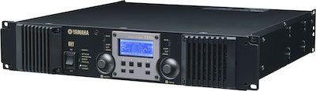

## Lautsprecher (Loudspeaker)

zwei typen
- Aktiv-Lautsprecher
- Passiv-Lautsprecher

### Aktiv-Lautsprecher (Powered Loudspeaker)
eine integrierte Einheit aus Lautsprecher und Verstärker in einem Gehäuse.

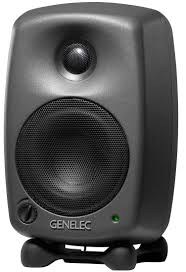

- Genelec 8020A / typischer Akitiv-Lautsprecher für ein elektronisches Studio

### Passiv-Lautsprecher (Passive Loudspeaker)
bekommen das Signal von einem externen Verstärker an die Eingangsbuchsen geliefert und verteilen es über die Frequenzweiche an ihre Lautsprecher.

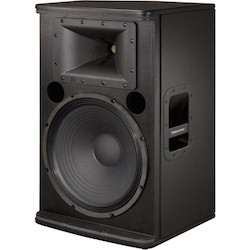
Electro Voice ELX 115

### Der Mechanismus
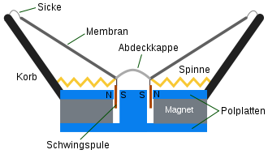

Zur Umwandlung elektrischer Signale in Schallwellen wird ein Medium durch elektrische Energie in mechanische Schwingungen versetzt. Diese Funktion übernimmt fast immer eine Membran; ihr Antrieb erfolgt über ein elektromagnetisches Feld.

Ein Lautsprecher besteht daher in den meisten Fällen aus drei Komponentengruppen: Der Membran, der Antriebseinheit sowie deren verbindenden Elementen. Beim Standardmodell des sogenannten Tauchspulenlautsprechers wird die Membran von einer mittig angebrachten Schwingspule in Bewegung versetzt; zum Antrieb gehört neben der Spule ein Magnet, in dessen Feld sie schwingt. Ein Korb verbindet den Magneten mit einer Sicke sowie einer Zentrierspinne, welche ihrerseits die Membran führen.

### Einteilung nach Anzahl der Wege

Mit einem einzigen Lautsprecher lässt sich das gesamte Hörspektrum nur schwer wiedergeben. Große Membranflächen, die das für Bässe nötige Luftvolumen verschieben können, bündeln den Schall bei höheren Frequenzen stark; Konusmembranen haben zudem mit Partialschwingungen zu kämpfen. Kleine Membranflächen können raschen Auslenkungen leichter folgen und weisen ein besseres Rundstrahlverhalten auf, schwächeln aber bei der Basswiedergabe.

Aus diesem Grund werden Lautsprecher („Chassis“) seitens ihrer Hersteller vorzugsweise für die Reproduktion spezifischer Frequenzbereiche optimiert.

#### 2-Wege (2 way Loudspeaker)
Hier kommen im Allgemeinen ein Bass/Mittelton- und ein Hochtonlautsprecher zum Einsatz. Nach diesem System sind die meisten Kompaktboxen aufgebaut.

#### 3-Wege Lautsprecher ( 3 way loudspeaker )
Hier wird der Frequenzbereich in drei Zweige aufgeteilt. Wie das Bild rechts zeigt, können dabei auch mehr als drei Lautsprecher zur Anwendung kommen: Die beiden Mitteltöner der Box arbeiten parallel am gleichen Zweig.

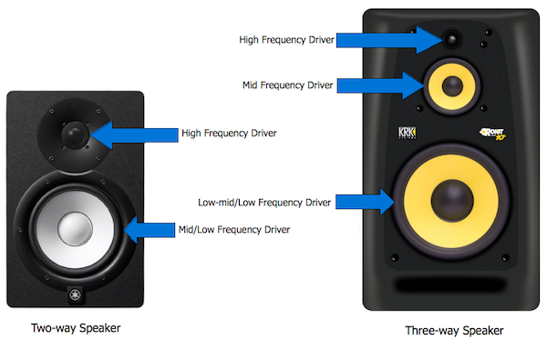

### Frequenzweiche (Crossover)
Eine Frequenzweiche teilt ein verschiedene Frequenzen enthaltendes elektrisches Signal auf zwei oder mehr Ausgänge auf, an denen jeweils unterschiedliche Teile (Frequenzbänder) des gesamten ursprünglichen Frequenzspektrums austreten.

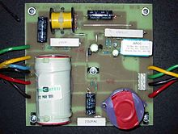

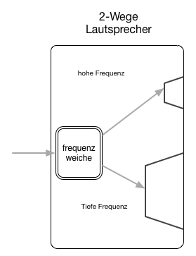

### Subwoofer
ist eine spezielle Lautsprecherbox, die von ihrer Konstruktion her für die alleinige Wiedergabe tieffrequenter Schallwellen, dem so genannten Bass oder sogar nur Tiefbass, konzipiert ist.

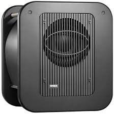

### Bekannte Hersteller von Lautsprecher

- [Meyersound](http://www.meyersound.com)
Stadtgarten Köln benutzen Meyer CQ1
- [Electro Voice](http://www.electrovoice.com)
Sher oft benutzt von Rock Musiker
- [Mackie](http://mackie.com)
Sehr bekannt. nicht so teuer.
- [Genelec](http://www.genelec.com)
Viele elektronisch Studios benutzen 80x0 Monitor.
- [Adam Audio](http://www.adam-audio.com/de)
Chikashi benutzt Adam Monitor
- [Behringer](http://www.behringer.com)
Günstig Günstig
- [Dynaudio](http://www.dynaudio.com)
BBC benutzt Lautsprecher von Dynaudio
- [JBL](http://de.jbl.com)

## Mischpult (Mixing Console)
Ein Mischpult dient dazu, elektrische Tonsignale von verschiedenen Quellen (z. B. Mikrofone, Abspielgeräte oder elektronische Klangerzeuger) auf zwei oder mehr Ausgangssummen meistens nach Frequenzgangs- und Dynamikveränderungen, zusammenzufügen. Für Mischungen in Stereofonie werden zum Beispiel alle am Mischpult anliegenden Signale auf die Stereo-Kanäle „Links“ und „Rechts“ zusammengeführt. Audio-Mischpulte gibt es in den Ausführungen *Analogmixer*, *Digitalmixer* und *Powermixer*.

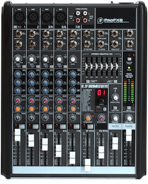 Mackie ProFX8 (Analogmixer)
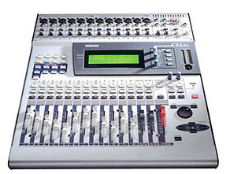 Yamaha o1v (Digitalmixer)
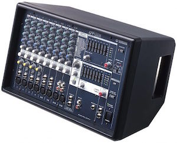 Yamaha EMX 512 SC (Powermixer)

### Eingangsverstärkung (Gain)
Über einen Drehregler (Eingangsverstärkung = Gain) wird der Eingangspegel der Signalquelle dem optimalen Arbeitsbereich des Mischpultes angepasst.  Zur optischen Kontrolle eines jeden Kanalpegels ist oft entweder ein Peakmeter oder ein vu-Meter vorhanden.

### Abdämpfungsschalter (Pad)
Ergänzend zum Gainregler findet sich meist ein Pad-Schalter (), mit dem ein zu lautes Eingangssignal um einen bestimmten Betrag (meist 20 dB) abgesenkt werden kann.

### Equalizer (EQ)
ist ein Filter als elektronische Komponente zur Tongestaltung und zur Entzerrung von Tonfrequenzen, überwiegend Musik, oder von anderen frequenzbasierten Signalen wie amplitudenmodulierten Datensignalen.

#### Parametrischer Equalizer
können für ein oder mehrere Frequenzbänder die Mittenfrequenz und die Amplitudenänderung (semiparametrischer Equalizer) sowie häufig auch die Filtergüte Q (entsprechend der Bandbreite) eingestellt werden (vollparametrischer Equalizer). Diese Bauform findet man vor allem in Mischpulten und Effektgeräten.
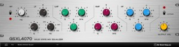

#### Grafischer Equalizer
ist jedem beeinflussbaren Frequenzband ein eigener Regler zugeordnet (er hat 26 bis 33, typischerweise 31 Frequenzbänder von je 1/3 Oktave Breite), so dass der Verlauf der Frequenzkorrektur „grafisch“ durch die Regler dargestellt wird. Diese Art von Equalizern wird auch x-Band-Equalizer genannt. Das x steht hier für die Anzahl der Regler (bei 31 Reglern als 31-Band-Equalizer).

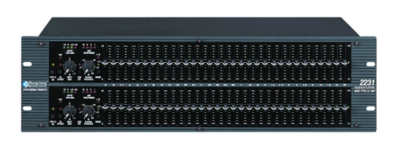

#### Phantomspeisung
Phantomspeisung bezeichnet in der Tontechnik eine besondere Art der Spannungsversorgung von Kondensatormikrofonen mit einer Gleichspannung zwischen 9 und 48 V. In der Praxis weit verbreitet ist eine Speisespannung von 48 V ±4 V.

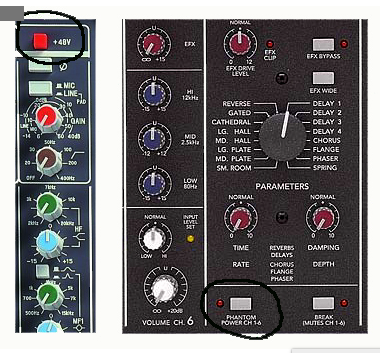

#### Mute / Schieberegler
Im weiteren Verlauf des Kanalzugs folgen anschließend der Ein-/Ausschalter (On/Off, Mute) sowie als elementares Bauteil der bei jedem Mischpult vorhandene Schieberegler für den Kanalpegel, üblicherweise als Fader bezeichnet, bei Kompaktmischern auch als Drehpotentiometer ausgeführt.

#### Panpot
Im Signalweg hinter dem Fader folgt der Panoramaregler (auch Panpot genannt, entgegen der Logik auf dem Bedienfeld über dem Fader angeordnet), mit welchem bestimmt werden kann, wie das Signal im Stereobild der Mischpultsumme positioniert ist. Er ist ein Überblendregler (ähnlich einem Crossfader) und dient dazu, ein Signal nach dem Kanal-Fader auf den rechten und linken Kanal in der Stereosumme zu verteilen.

#### Aux
Das Signal eines Kanals kann an verschiedenen Stellen im Kanalzug auf sogenannte Effekt- oder Monitorwege (Auxiliary-Wege = Hilfswege) geschickt werden. Meistens sind derartige Aux-Wege zwischen „pre-fader“ (Signal wird hinter der Filtersektion, vor dem Kanal-Fader abgezweigt, ist also unabhängig von dessen Stellung) und „after-“ beziehungsweise „post-fader“ (Signal ist abhängig vom Kanal-Fader) umschaltbar. Die Regler dafür finden sich auf dem Bedienfeld meist direkt über dem Panpot.

##### Anwendungen von Aux

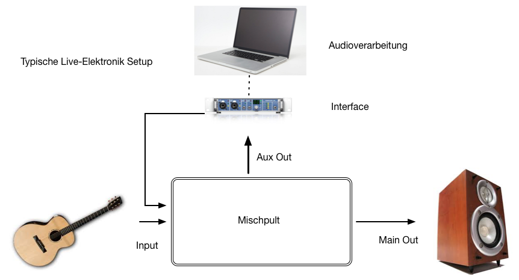

---
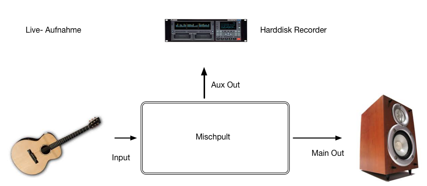

---

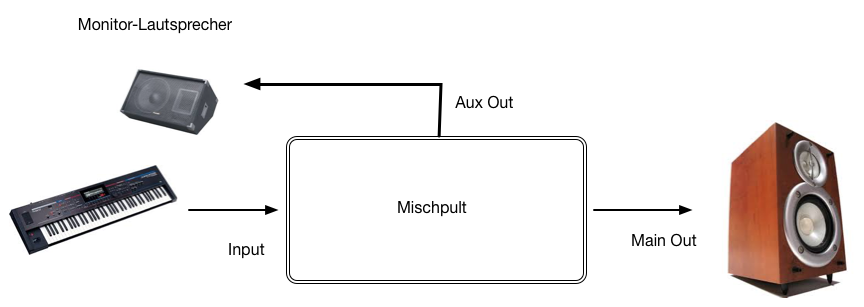

###### Monitorlautsprecher
Bei Veranstaltungen mit Live-Musik gibt es meistens Monitorlautsprecher zur Beschallung der Musiker auf der Bühne, da die Beschallungsanlage für das Publikum die Bühne nicht ausreichend abdeckt. Das Monitoring dient Künstlern zur Kontrolle ihres eigenen Spielens, Gesangs oder Sprechens und bietet eine Orientierung an ihrem akustischen Umfeld.
> [BlockDiagram](Klasse6/ProFX-OM.pdf) eines Mischpults

# Terminologien

1. PA-Anlage
2. Verstärker
3. Aktivlautsprecher
4. Passivlautsprecher
5. 2-Wege / 3 Wege
6. Subwoofer
7. Frequenzweiche
8. Mischpult
9. Analog-, Digital- und Powered-Mixer
10. Eingangsverstärkung (Gain)
11. Abdämpfungsschalter (Pad)
12. Equalizer (EQ)
13. Parametrischer Equalizer
14. Grafischer Equalizer
15. Phantomspeisung
16. Aux
17. Panpot
18. Monitorlautsprecher
