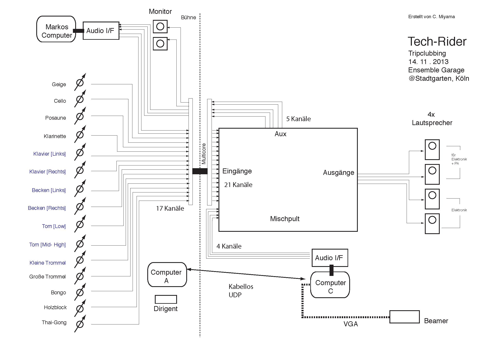

# Klasse 6

## PA (Public Address) Anlage
ist eine Beschallungsanlage, welche der Wiedergabe und Verstärkung von Sprache oder Musik dient. Sie besteht aus **Lautsprechern** und **Verstärkern**. Oft werden auch das steuernde Mischpult und die zugehörigen Effektgeräte der PA zugerechnet. PA-Anlagen werden überall dort eingesetzt, wo es nötig ist, große Flächen möglichst gleichmäßig zu beschallen.

## Lautsprecher

zwei typen
- Aktiv-Lautsprecher
- Passiv-Lautsprecher

### Aktiv-Lautsprecher (Active Loudspeakers)
eine integrierte Einheit aus Lautsprecher und Verstärker in einem Gehäuse.

### Passiv-Lautsprecher (Passive Loudspeakers)
bekommen das Signal von einem externen Verstärker an die Eingangsbuchsen geliefert und verteilen es über die Frequenzweiche an ihre Lautsprecher.

### Subwoofer
ist eine spezielle Lautsprecherbox, die von ihrer Konstruktion her für die alleinige Wiedergabe tieffrequenter Schallwellen, dem so genannten Bass oder sogar nur Tiefbass, konzipiert ist.

## Mischpult (Mixing Console)
Ein Mischpult dient dazu, elektrische Tonsignale von verschiedenen Quellen (z. B. Mikrofone, Abspielgeräte oder elektronische Klangerzeuger) auf zwei oder mehr Ausgangssummen meistens nach Frequenzgangs- und Dynamikveränderungen, zusammenzufügen. Für Mischungen in Stereofonie werden zum Beispiel alle am Mischpult anliegenden Signale auf die Stereo-Kanäle „Links“ und „Rechts“ zusammengeführt. Audio-Mischpulte gibt es in den Ausführungen *Analogmixer*, *Digitalmixer* und *Powermixer*.

 Mackie ProFX8 (Analogmixer)
 Yamaha o1v (Digitalmixer)
 Yamaha EMX 512 SC (Powermixer)

## Kanal

#### Symmetrisch (Blanced)

#### Unsymmetrisch (Unbalanced)

### Kondensator Mikrofon

### Dynamisch Mikrofon

### Phantom

### Gain

### Equalizer (EQ)
ist ein Filter als elektronische Komponente zur Tongestaltung und zur Entzerrung von Tonfrequenzen, überwiegend Musik, oder von anderen frequenzbasierten Signalen wie amplitudenmodulierten Datensignalen.

#### 

### Aux Out

### Pegel

### Panning

### Mute

# Kabel

### XLR

### Klinke (TRS)

## Techrider

# Terminologien

1. Mischpult
2. Kanal
3. Dynamisch Mikrofon
4. Kondensator Mikrofon
5. Phantom
6. Pegel
7.
8. Gain
9. Equalizer
10. Aux
12. Panning
13. Pegel
14. Solo
15. Mute
16. XLR
17. Klinke
18. symmetrisch
19. unsymmetrisch
20. RCA
21. Techrider
