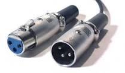
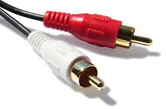

# Klasse 7
# Kabel

## Audiokabel (Analog)

### Symmetrische Signalübertragung
Symmetrische Signalübertragung ist ein Verfahren, um Signale auch bei längeren Übertragungswegen möglichst störungstolerant übermitteln zu können. Die Übertragung erfolgt dabei statt mit einem einzigen Signalleiter mit einem Paar solcher. Die Beeinflussung des Nutzsignals durch Einkopplungen auf dem Übertragungsweg ist bei symmetrischer Signalübertragung auf beiden Leitern nahezu gleichartig, so dass sich bei Differenzbildung der beiden Leiter-Potenziale die Störung (nahezu) aufhebt.

### Unsymmetrisches Signalübertragung
Die unsymmetrische Signalübertragung ist die einfachste Art der Datenübertragung. Ein Leiter führt eine Spannung, die sich je nach Signal ändert. Es ist aber anfälliger für elektromagnetische Einstreuungen.

### XLR
ist ein Industriestandard für elektrische Steckverbindungen. In der professionellen Beschallungs- und Tonstudio-Technik werden XLR-Steckverbinder für analoge Mikrofon- und Lautsprecher-Signale verwendet.

Der dreipolige XLR-Steckverbinder stellt in der professionellen Tontechnik die Standardverbindung für analoge Audioleitungen dar, insbesondere bei **symmetrischer Signalübertragung**.

[How to solder XLR by yourself](https://www.youtube.com/watch?v=89XDGtJzzBc)

### Multicore
dienen  mehrere Audiosignale von der Bühne zum Mischpult und zurück zu führen.

 8 Kanal Multicore-Trommel.

### Klinkenstecker (Phone/Audio Jack)
sind international weit verbreitete elektrische Steckverbinder.
 Je nach Anzahl der Pole hat der Klinkenstecker außer der Spitze (Tip) und dem Schaft (Sleeve) unterschiedlich viele Ringe, wodurch sich die englische Bezeichnung ergibt (s. u.), beispielsweise TRS für den dreipoligen 6,3-mm(1/4")-Stecker, umgangssprachlich auch audio jack.

#### Monostecker (TS = top, sleeve)
Der Monostecker führt an der Spitze das Signal und am hinteren Teil – der Hülse – die Abschirmung und Rückleitung („Masse“). Die Übertragung erfolgt daher asymmetrisch.

#### Stereostecker (TRS = top, ring, sleeve)
Der Stereostecker ist die Weiterentwicklung des Monosteckers. Um den dritten Kontakt für den zweiten Kanal unterzubringen, wurde ein Ring von der Hülse abgetrennt.

Die Spitze ist mit dem Signal für den linken Kanal belegt, der Ring hinter der Spitze mit dem Signal für den rechten Kanal. Der hintere Teil, die Hülse, ist wie beim Monostecker mit der Abschirmung und Rückleitung belegt. Diese Art der Signalübertragung erfolgt ebenfalls asymmetrisch.

#### Symmetrische Verbindung
In der professionellen Audiotechnik werden meist symmetrische Verbindungen benutzt, bei denen das Signal getrennt von der Abschirmung und dem Massepotenzial über zwei gleichwertige Leitungen – eine phasenrichtige (hot) und eine phasenverkehrte (cold) – übertragen wird. Da Störungen durch Einstreuungen meist beide Leiter gleich betreffen, kann der Empfänger sie eliminieren, indem er die Differenz der beiden Signale auswertet. Der hintere Teil, die Hülse, ist wie beim Monostecker mit der Abschirmung belegt. Steckt man einen Monostecker in eine symmetrisch beschaltete Buchse, schließt man die phasenumgekehrte Leitung gegen Masse kurz, was je nach Schaltungsdesign zu Schäden führen kann. Oft werden für symmetrische Verbindungen XLR-Stecker verwendet, aus Platz- oder Kostengründen allerdings auch oft die gleichen Klinkenstecker wie für Stereo-Anschlüsse.

### Cinch (RCA)
ist eine weit verbreitete umgangssprachliche Bezeichnung für genormte Steckverbinder zur **umsymmetrischen Übertragung**.

RCA = Radio Corporation of America

### DI-Box

Die DI-Box (Abkürzung für Direct Injection) ist ein in der Tontechnik verwendetes Gerät, das ein asymmetrisches Signal in ein symmetrisches Signal umwandelt.

## Audiokabel (Digital)

### S/PDIF (Sony/Philips Digital Interface Format)
ist eine Schnittstellen-Spezifikation für die elektrische oder optische Übertragung digitaler Stereo- oder Mehrkanal-Audiosignale zwischen verschiedenen Geräten für die Anwendung im Unterhaltungselektronikbereich. S/PDIF wird z. B. bei CD-Spielern, DAT-Recordern, bei MiniDisc, zwischen DVD-Player und Heimkinoreceiver und bei digitalen Audiokarten in PCs verwendet.

 Als Steckverbinder werden ein **Cinch-Anschluss** oder ein optischer **TOSLINK-Anschluss** verwendet.

#### Cinch-Anschluss

#### TOSLINK
 ist ein ursprünglich von Toshiba entwickeltes (daher der Name TOShiba-LINK), standardisiertes　Lichtwellenleiter-Verbindungssystem für optische Signalübertragungen im Bereich bis etwa 20 Mbit/s.

### USB
Der Universal Serial Bus (USB) ist ein serielles Bussystem zur Verbindung eines Computers mit externen Geräten. Mit USB ausgestattete Geräte oder Speichermedien (USB-Speichersticks) können im laufenden Betrieb miteinander verbunden (Hot Swapping) und angeschlossene Geräte sowie deren Eigenschaften automatisch erkannt werden. Vor der Einführung von USB gab es eine Vielzahl verschiedener Schnittstellentypen mit unterschiedlichsten Steckern zum Anschluss von Zubehör und Peripheriegeräten an Heim- und Personal Computer. Fast alle diese Schnittstellenvarianten wurden durch das einheitliche USB ersetzt, was erhebliche Vereinfachungen für Anwender mit sich brachte. Ursprünglich 1996 eingeführt, wurde im Jahr 2000 die heute noch meistverbreitete Version USB 2.0 spezifiziert, mit der deutlich höhere Datenübertragungsraten möglich wurden. Die aktuelle, 2008 definierte Version 3.0 bietet einen neuen „SuperSpeed“-Übertragungsmodus mit einer Datentransferrate von 5 Gbit/s.

#### USB

#### mini USB

#### micro USB

#### Logo

### Firewire / IEEE 1394
ist ein Bus für serielle Datenübertragung.  

#### Firewire 400

#### Firewire 800

Die Zahlen hinter dem „FireWire“ geben die gerundete Transferrate in Megabit pro Sekunde wieder. Die exakte Datenrate der Firewire 400 beträgt 393.216.000 Bit je Sekunde (Bit/s ≈ 48 MB/s).

#### Logo

### Thunderbolt
ist die Bezeichnung für die von Intel in Zusammenarbeit mit Apple zunächst unter dem Codenamen Light Peak entwickelte Schnittstelle zwischen Computern, Monitoren, Peripheriegeräten und Unterhaltungselektronik.

[Demo](https://www.youtube.com/watch?v=gk69pCcVSSQ)

thunderbolt hub

### Geschwindichkeit USB / Firewire / Thunderbolt

## Video Kabel

### VGA

Video Graphics Array (kurz: VGA) ist ein Computergrafik-Standard, der bestimmte Kombinationen von Bildauflösung und Farbanzahl (Farb-Bit-Tiefe) sowie Wiederholfrequenz definiert.

### DVI

Digital Visual Interface (DVI) ist eine elektronische Schnittstelle zur Übertragung von Videodaten. Im Computer-Bereich entwickelte sich DVI zu einem Standard für den Anschluss von TFT-Monitoren an die Grafikkarte eines Computers.

### HDMI

High Definition Multimedia Interface ist eine Schnittstelle für die volldigitale Bild- und Ton-Übertragung in der Unterhaltungselektronik. Sie vereinheitlicht existierende Verfahren, erhöht gegenüber diesen die Qualitätsmerkmale und besitzt außerdem ein zusammenhängendes Kopierschutz­konzept (DRM). D

### Displayport

DisplayPort ist ein durch die VESA genormter, universeller und lizenzfreier Verbindungsstandard für die Übertragung von Bild- und Tonsignalen. Anwendungsbereiche sind im Wesentlichen der Anschluss von Bildschirmen und Fernsehgeräten an Computer, DVD-Spieler und ähnliche Geräte.

[Unterschied](http://youtu.be/f38sotYHqtA)

## Terminologien

1. Symmetrische Signalübertragung
2. Unsymmetrisches Signalübertragung
3. XLR
4. Multicore
5. Klinkenstecker (Phone)
5. Monostecker
6. Stereostecker
5. Cinch (RCA)
6. S/PDIF
7. TOSLINK
7. USB
8. mini USB
9. micro USB
10. Firewire / IEEE 1394
11. Firewire 400 / 800
12. Thunderbolt
13. Multicore
14. D/I Box
15. VGA
16. DVI
17. HDMI
18. Displayport
