# Klasse 8
# Mikrofon I

## Mikrofon (Microphone)

Ein Mikrofon oder Mikrophon ist ein **Schallwandler**, der Luftschall als Schallwechseldruckschwingungen in entsprechende elektrische Spannungsänderungen als Mikrofonsignal umwandelt.

### Wandler (Transducer)
Gerät, Vorrichtung, die eine physikalische Größe in ihrem Wert verändert oder in eine andere Größe umwandelt.

## Typen

### Dynamikmikrofon (dynamic microphone)
bezeichnet man ein Mikrofon, das Schalldruckimpulse nach dem Prinzip der *elektromagnetischen Induktion* in äquivalente elektrische Spannungsimpulse wandelt.

### elektromagnetischen Induktion (electro magnetic induction)
Unter elektromagnetischer Induktion versteht man das Entstehen eines elektrischen Feldes durch Änderung der magnetischen Flussdichte.
In vielen Fällen lässt sich das elektrische Feld durch Messung einer elektrischen Spannung direkt nachweisen. Ein typisches Beispiel hierfür zeigt das untenstehende Bild: Durch die Bewegung des Magneten wird eine elektrische Spannung induziert, die an den Klemmen der Spule messbar ist und für weitere Anwendungen bereitsteht.

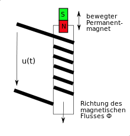

- [Simple Electricity Generator](https://www.youtube.com/watch?v=0OHmMVBLXTI)

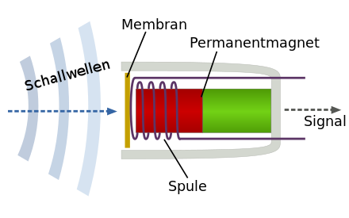

- Dynamischemirofon und Lautsprecher sind im Prizip gleich

[Nicholas Collins Demo](http://youtu.be/0R63MOFTxx8?list=PLyFW-rnLqSeGxwsL0FL160g8y6XmdHZcQ)

### Kondensatormikrofon (condensor microphone)
Das Kondensatormikrofon ist ein elektroakustischer Wandler, der Schall in ein entsprechendes elektrisches Signal wandelt.

Dieses Mikrofon nutzt die durch Abstandsänderungen zwischen der (beweglichen) Membran und der Gegenelektrode hervorgerufene Kapazitätsänderungen, um je nach Ausführung Schalldruck oder Schallschnelle in ein elektrisches Signal umzuwandeln.

#### Kondensator
ist ein passives elektrisches Bauelement mit der Fähigkeit, in einem Gleichstromkreis elektrische Ladung und die damit zusammenhängende Energie statisch in einem elektrischen Feld zu speichern. Die gespeicherte Energie wird als elektrische Kapazität bezeichnet und in der Einheit Farad gemessen.

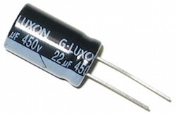

[Vergleich Kondensator und Dynamik](https://www.youtube.com/watch?v=27dLLnisH2M)

### Die Große von Membran

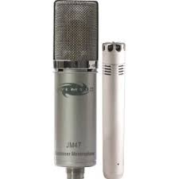

| Kriterium |kleinmembran|großmembran|
|-----------|------------|-----------|
|Rauschen | hoch | niedrig|
|Empfindlichkeit| niedrig| hoch |
|Frequenzbereich | breit | schmal |

[Difference between small and large diaphram](http://www.dpamicrophones.com/da/MikrofonUniversitet/Tech-Guide/Large-Diaphragm.aspx)

## Richtcharakteristik (Polar Pattern)
beschreibt die Abhängigkeit der Empfindlichkeit eines Mikrofons, also der Ausgangsspannung im Verhältnis zum Schalldruck, vom Schalleinfallswinkel.Oft wird nur ein horizontaler Schnitt angegeben. Der Richtcharakter hängt ab von der Bauform der Mikrofonkapsel und von äußeren Formelementen (z. B. Richtrohrmikrofon).

### Kugel (Omnidirectional)

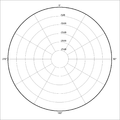
### Acht (Figure of eight)

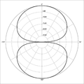
### Breite Niere (Subcardioid)

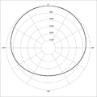
### Niere (Cardioid)

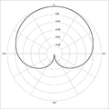

### Hyperniere (Omni directional)

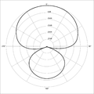

### Superniere (Super Cardioid)
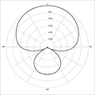

einige Mikrophone haben einen Schalter für unterschiedliche Richtcharakteristik.

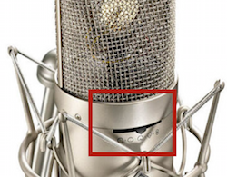

## Frequenzgang

Der Frequenzgang gibt an, wie empfindlich ein Mikrofon bei verschiedenen Frequenzen ist. Generell gibt es zwei verschiedene Arten:

### Linearer Frequenzgang (Flat frequency response)
Alle Frequenzen im hörbaren Bereich (20 Hz – 20 kHz) werden gleich laut wiedergegeben. Dies ist besonders für Anwendungen geeignet, bei denen die Klangquelle so originalgetreu wie möglich wiedergegeben werden soll, z. B. bei Studioaufnahmen.

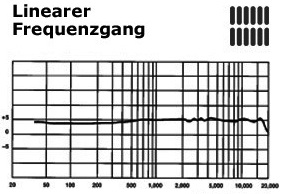

### Konturierter Frequenzgang (Tailored frequency response)
Für viele Anwendungsgebiete ist es sinnvoll, bestimmte Frequenzen verstärkt wiederzugeben. Durch einen konturierten Frequenzgang kann beispielsweise eine Stimme mehr Durchsetzungsvermogen bekommen, sie kann wärmer und brillanter klingen.

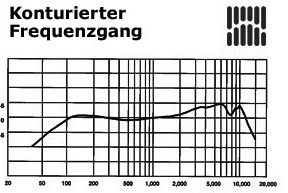

## Problem mit Mikrofon
### Nahbesprechungseffekt (Proximity Effect)
ist eine Überbetonung (höhere Empfindlichkeit) der tiefen Frequenzen bei Richtmikrofonen im Nahfeld einer Schallquelle. Im Zusammenspiel mit der üblichen, technischen Bassanhebung, die eigentlich dem Zweck dient, die Aufnahmeschwäche von Druckgradientenmikrofonen bei tiefen Frequenzen zu kompensieren, entsteht ein dumpfer, unnatürlicher Klang.

### Windschutz (Pop filter)

Ein Mikrofon-Windschutz ist meistens ein aus offenporigem Schaumstoff gefertigter Überzug für Mikrofone. Der Wind- oder Popschutz wirkt - zusätzlich zu der üblicherweise im Mikrofonkorb eingesetzten inneren Schaumstoffeinlage - gegen tieffrequente Schallanteile verwirbelnder Luftbewegungen (Wind) sowie der menschlichen Aussprache.

### Rückkopplung (Feedback)
 bezeichnet man einen Audio-Effekt, bei dem das Signal eines Schallempfängers über Lautsprecherbox wiedergegeben wird und nochmal als Schall empfangen wird. Dadurch wird das erneut empfangene Signal wieder ausgegeben, usw. Die bekannteste Folge ist ein charakteristisches, meist als schrill empfundenes Pfeifen.

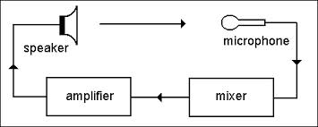

- [Grafik EQ und feedback](http://youtu.be/b-f9qw18PRU?t=3m34s)

### Techrider
Ein Stage Rider oder Technical Rider (meistens nur TecRider oder TechRider) ist ein Dokument, das die technischen Anforderungen eines Künstlers für seine Auftritte beschreibt. Meistens handelt es sich dabei um Musiker und Bands, die dadurch im Vorfeld einer Veranstaltung dem Veranstalter und den Ton- und Lichttechnikern die Planung erleichtern.

- Ein Beispiel von Techrider
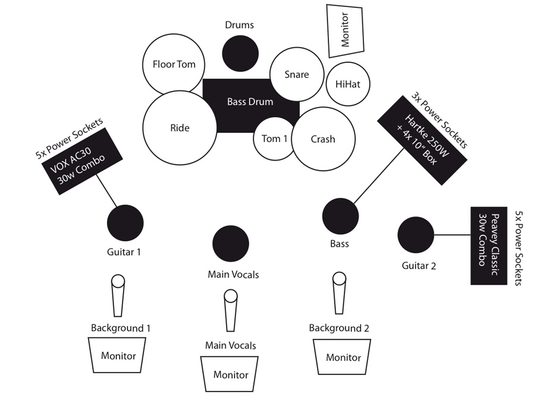

- Techrider von Chikashi
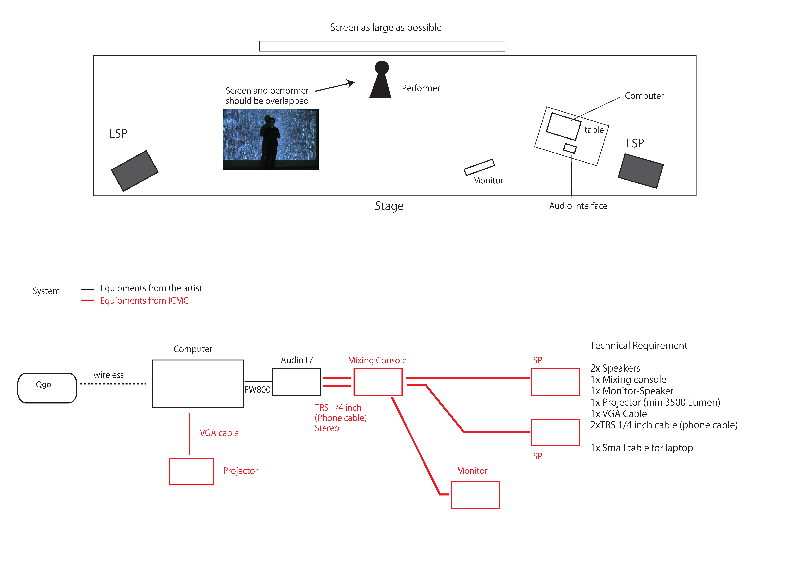

### Hausaufgabe für Elektroniker
Schreiben Sie einen Techrider des Stücks für das Studiokonzert. Der Techrider muss die folgende Informationen beinhalten:

- Bühnenplan (Position der Instrumenten, Monitor etc.)
- System-Diagramm
- Liste der Ausrüstungen
- Name des Stücks
- Ort der Veranstaltung

# Terminologien

1. Mikrofon (Microphone)
2. Wandler  (Transducer)
3. Dynamikmikrofon (dynamic microphone)
4. elektromagnetischen Induktion (electro magnetic induction)
5. Kondensatormikrofon (condensor microphone)
6. Kondensator
7. Piezomikrofon
8. Piezoelektrizität (Piezoelectricity)
9. Richtcharakteristik
10. Richtcharakteristik (Polar Pattern)
11. Kugel
12. Acht
13. Breite Niere
14. Niere
15. Hyperniere
16. Superniere
17. Windschutz
18. Frequenzgang
19. Linearer Frequenzgang (Flat frequency response)
20. Konturierter Frequenzgang (Tailored frequency response)
21. Nahbesprechungseffekt
22. Windschutz (Pop filter)
23. Rückkopplung (Feedback)
