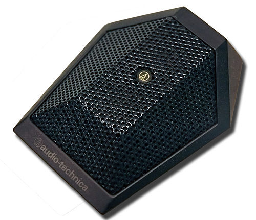

# Klasse 8
# Mikrofon

## Mikrofon (Microphone)
Ein Mikrofon oder Mikrophon ist ein **Schallwandler**, der Luftschall als Schallwechseldruckschwingungen in entsprechende elektrische Spannungsänderungen als Mikrofonsignal umwandelt.

### Wandler (Transducer)
Gerät, Vorrichtung, die eine [physikalische] Größe in ihrem Wert verändert oder in eine andere Größe umwandelt.

## Typen
### Kondensatormikrofon
Das Kondensatormikrofon (engl. condenser microphone, capacitor microphone) ist ein elektroakustischer Wandler, der Schall in ein entsprechendes elektrisches Signal wandelt.

Dieses Mikrofon nutzt die durch Abstandsänderungen zwischen der (beweglichen) Membran und der Gegenelektrode hervorgerufene Kapazitätsänderungen, um je nach Ausführung Schalldruck oder Schallschnelle in ein elektrisches Signal umzuwandeln.

### Dynamikmikrofon

### Elektret-Kondensatormikrofon

### Piezomikrofon

## Akustische Bauformen

## Richtcharakteristik (Polar Pattern)
beschreibt die Abhängigkeit der Empfindlichkeit eines Mikrofons, also der Ausgangsspannung im Verhältnis zum Schalldruck, vom Schalleinfallswinkel.Oft wird nur ein horizontaler Schnitt angegeben. Der Richtcharakter hängt ab von der Bauform der Mikrofonkapsel und von äußeren Formelementen (z. B. Richtrohrmikrofon).

### Kugel (Omnidirectional)

### Acht (Figure of eight)

### Breite Niere (Subcardioid)

### Niere (Cardioid)

### Hyperniere (Omni directional)

### Superniere (Super Cardioid)

einige Mikrophone haben einen Schalter für unterschiedliche Richtcharakteristik.

## Mikrofonsignal

## Frequenzgang

## Nahbesprechungseffekt (Proximity Effect)
ist eine Überbetonung (höhere Empfindlichkeit) der tiefen Frequenzen bei Richtmikrofonen im Nahfeld einer Schallquelle. Im Zusammenspiel mit der üblichen, technischen Bassanhebung, die eigentlich dem Zweck dient, die Aufnahmeschwäche von Druckgradientenmikrofonen bei tiefen Frequenzen zu kompensieren, entsteht ein dumpfer, unnatürlicher Klang.

## Windschutz (Pop filter)

Ein Mikrofon-Windschutz ist meistens ein aus offenporigem Schaumstoff gefertigter Überzug für Mikrofone. Der Wind- oder Popschutz wirkt - zusätzlich zu der üblicherweise im Mikrofonkorb eingesetzten inneren Schaumstoffeinlage - gegen tieffrequente Schallanteile verwirbelnder Luftbewegungen (Wind) sowie der menschlichen Aussprache.

## Besondere Mikrofone

### Richtrohrmikrofon (Shotgun Microphone)
besitzt eine ausgeprägte Keulencharakteristik, die durch ein vor ein Druckgradientenmikrofon vorgebautes, mit seitlichen Schlitzen oder Bohrungen versehenes, nach vorn offenes Interferenzrohr zustande kommt. Dieses bewirkt, abhängig von der Rohrlänge, eine deutliche Verstärkung der Richtwirkung ab etwa 1 bis 2 kHz. Bei tieferen Frequenzen entspricht die Richtwirkung derjenigen der Mikrofonkapsel (Nieren- oder Supernierencharakteristik).Als Wandler sind Kondensator- oder Elektretmikrofone üblich.

- [Shure Shotgun microphone tutorial](https://www.youtube.com/watch?v=h3LSEnI3ko0)

### Grenzflächenmikrofon (Boundary Microphone)
Ein Grenzflächenmikrofon ist eine Sonderbauform von Mikrofonen, bei denen das Gehäuse Teil des Schallwandlers ist.

Diese Bauart wurde entwickelt, um die vorteilhaften akustischen Eigenschaften auszunutzen, die an schallreflektierenden Flächen auftreten, ohne das Schallfeld selbst zu beeinträchtigen. Das Mikrofon wird auf eine große schallreflektierende Fläche, z. B. auf den Fußboden, gelegt. Es erhält so den maximalen Schalldruck mit verringerten Raumschallanteilen.

## Stereomikrofon

### XY
Die XY-Stereofonie ist ein Stereo- Mikrofonierungsverfahren für die Lautsprecherstereofonie. Es arbeitet nur mit Pegeldifferenzen zwischen den Kanälen Links und Rechts. Zwei gerichtete Einzelmikrofone werden dabei in möglichst geringem Membranabstand vertikal übereinander als Hauptmikrofonsystem angeordnet. Die Pegeldifferenzen ergeben sich durch die Richtwirkung der nach außen gedrehten Mikrofone. Somit gibt es nur Interchannel-Pegeldifferenz und keine Interchannel-Laufzeitdifferenz.

### AB
Die AB Stereophonie platziert zwei völlig getrennte Mikrophone mit großem räumlichem Abstand voneinander vor der Schallquelle. Die Ortung auf der Stereobasis beruht bei diesem Verfahren in erster Linie auf der Laufzeit des Schalls zwischen den beiden Mikrophonen und nur in zweiter Linie auf der unterschiedlichen Intensität. Mit der Laufzeit-Stereophonie ergeben sich ohne große Mühe bei der Aufstellung sehr räumliche klingende Aufnahmen.

### ORTF
Bei der ORTF-Stereophonie (Office de Radiodiffusion Télévision Française) werden nun beide Stereo-Techniken (AB und XY) miteinander kombiniert. Hierfür werden zwei Nieren-Mikrofone in einem Abstand von 17 cm und einem Winkel von 110° zueinander aufgestellt. Dadurch wird sowohl ein Laufzeit- als auch ein Intensitätsunterschied erzielt - was schon recht nahe an das natürliche Stereoempfinden herankommt.

[Visualisierung Stereofpnnie](http://www.sengpielaudio.com/Visualization-XY90.htm)
## Mikrofonhersteller

- [Schoeps](http://www.schoeps.de/en/home)
  - WDR benutzt Schoeps MK4 - MK5 für Aufnahme
- [AKG](http://www.akg.com/AKG-997.html)
  - Fast alle AufnahmeStudios haben AKG 414
- [Neumann](http://neumannusa.com)
  - Neumann U87i ist Perfekt für Gesang
- [Shure](http://www.shure.de)
  - Meiste Pop-Sänger benutzt SM-58 auf der Bühne
- [Sennheiser](http://en-de.sennheiser.com)
  - MD 421, gut für Schlagzeug
- [Behringer](http://www.behringer.com)
  - Günstig! Gut für dein erstes Mikro.

# Terminologien

1. Kondensatormikrofon
2.  Dynamikmikrofon
3.  Ribbommikrofon
4.  Elektret-Kondensatormikrofon
5.  Piezomikrofon
5. Richtcharakteristik
6. Kugel
7. Acht
8. Breite Niere
9. Niere
10. Hyperniere
11. Superniere
13. Windschutz
15. Nahbesprechungseffekt
15. Richtrohrmikrofon
17. Grenzflächenmikrofon
18. AB
19. XY
20. ORTF
