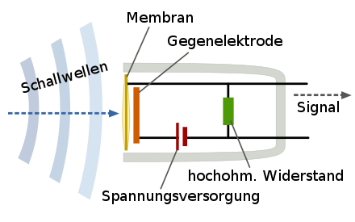
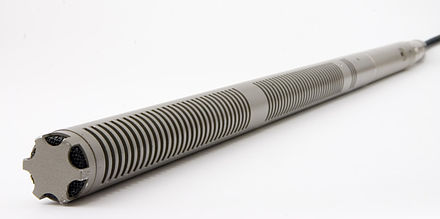

# Klasse 8
# Mikrofon I

## Mikrofon (Microphone)
Ein Mikrofon oder Mikrophon ist ein **Schallwandler**, der Luftschall als Schallwechseldruckschwingungen in entsprechende elektrische Spannungsänderungen als Mikrofonsignal umwandelt.

### Wandler (Transducer)
Gerät, Vorrichtung, die eine [physikalische] Größe in ihrem Wert verändert oder in eine andere Größe umwandelt.

## Typen
### Kondensatormikrofon
Das Kondensatormikrofon (engl. condenser microphone, capacitor microphone) ist ein elektroakustischer Wandler, der Schall in ein entsprechendes elektrisches Signal wandelt.

Dieses Mikrofon nutzt die durch Abstandsänderungen zwischen der (beweglichen) Membran und der Gegenelektrode hervorgerufene Kapazitätsänderungen, um je nach Ausführung Schalldruck oder Schallschnelle in ein elektrisches Signal umzuwandeln.

#### Kondensator
ist ein passives elektrisches Bauelement mit der Fähigkeit, in einem Gleichstromkreis elektrische Ladung und die damit zusammenhängende Energie statisch in einem elektrischen Feld zu speichern. Die gespeicherte Energie wird als elektrische Kapazität bezeichnet und in der Einheit Farad gemessen. 

### Dynamikmikrofon

### Elektret-Kondensatormikrofon

### Piezomikrofon
ist ein elektroakustischer Wandler, der Druckschwankungen in entsprechende elektrische Signale wandelt. Eine Membran folgt den Druckschwankungen. Sie ist mechanisch mit einem piezoelektrischen Element gekoppelt, das durch die Druckschwankungen minimal verformt wird. Die elektrische Spannungsschwankungen des piezoelektrischen Materials (meist Blei-Zirkonat-Titanat) werden zum Verstärker übertragen.

#### Piezoelektrizität (Piezoelectricity)
beschreibt die Änderung der elektrischen Polarisation und somit das Auftreten einer elektrischen Spannung an Festkörpern, wenn sie elastisch verformt werden (direkter Piezoeffekt). Umgekehrt verformen sich Materialien bei Anlegen einer elektrischen Spannung (inverser Piezoeffekt).

[Vergleich Kondensator und Dynamik](https://www.youtube.com/watch?v=27dLLnisH2M)

## Frequenzgang

## Richtcharakteristik (Polar Pattern)
beschreibt die Abhängigkeit der Empfindlichkeit eines Mikrofons, also der Ausgangsspannung im Verhältnis zum Schalldruck, vom Schalleinfallswinkel.Oft wird nur ein horizontaler Schnitt angegeben. Der Richtcharakter hängt ab von der Bauform der Mikrofonkapsel und von äußeren Formelementen (z. B. Richtrohrmikrofon).

### Kugel (Omnidirectional)

### Acht (Figure of eight)

### Breite Niere (Subcardioid)

### Niere (Cardioid)

### Hyperniere (Omni directional)

### Superniere (Super Cardioid)

einige Mikrophone haben einen Schalter für unterschiedliche Richtcharakteristik.

## Mikrofonsignal

## Frequenzgang

## Problem mit Mikrofon

### Nahbesprechungseffekt (Proximity Effect)
ist eine Überbetonung (höhere Empfindlichkeit) der tiefen Frequenzen bei Richtmikrofonen im Nahfeld einer Schallquelle. Im Zusammenspiel mit der üblichen, technischen Bassanhebung, die eigentlich dem Zweck dient, die Aufnahmeschwäche von Druckgradientenmikrofonen bei tiefen Frequenzen zu kompensieren, entsteht ein dumpfer, unnatürlicher Klang.

### Windschutz (Pop filter)

Ein Mikrofon-Windschutz ist meistens ein aus offenporigem Schaumstoff gefertigter Überzug für Mikrofone. Der Wind- oder Popschutz wirkt - zusätzlich zu der üblicherweise im Mikrofonkorb eingesetzten inneren Schaumstoffeinlage - gegen tieffrequente Schallanteile verwirbelnder Luftbewegungen (Wind) sowie der menschlichen Aussprache.

### Rückkopplung (Feedback)
 bezeichnet man einen Audio-Effekt, bei dem das Signal eines Schallempfängers über Lautsprecherbox wiedergegeben wird und nochmal als Schall empfangen wird. Dadurch wird das erneut empfangene Signal wieder ausgegeben, usw. Die bekannteste Folge ist ein charakteristisches, meist als schrill empfundenes Pfeifen.

## Besondere Mikrofone

### Richtrohrmikrofon (Shotgun Microphone)
besitzt eine ausgeprägte Keulencharakteristik, die durch ein vor ein Druckgradientenmikrofon vorgebautes, mit seitlichen Schlitzen oder Bohrungen versehenes, nach vorn offenes Interferenzrohr zustande kommt. Dieses bewirkt, abhängig von der Rohrlänge, eine deutliche Verstärkung der Richtwirkung ab etwa 1 bis 2 kHz. Bei tieferen Frequenzen entspricht die Richtwirkung derjenigen der Mikrofonkapsel (Nieren- oder Supernierencharakteristik).Als Wandler sind Kondensator- oder Elektretmikrofone üblich.

- [Shure Shotgun microphone tutorial](https://www.youtube.com/watch?v=h3LSEnI3ko0)

### Grenzflächenmikrofon (Boundary Microphone)
Ein Grenzflächenmikrofon ist eine Sonderbauform von Mikrofonen, bei denen das Gehäuse Teil des Schallwandlers ist.

Diese Bauart wurde entwickelt, um die vorteilhaften akustischen Eigenschaften auszunutzen, die an schallreflektierenden Flächen auftreten, ohne das Schallfeld selbst zu beeinträchtigen. Das Mikrofon wird auf eine große schallreflektierende Fläche, z. B. auf den Fußboden, gelegt. Es erhält so den maximalen Schalldruck mit verringerten Raumschallanteilen.

[Visualisierung Stereofpnnie](http://www.sengpielaudio.com/Visualization-XY90.htm)
## Mikrofonhersteller

- [Schoeps](http://www.schoeps.de/en/home)
  - WDR benutzt Schoeps MK4 - MK5 für Aufnahme
- [AKG](http://www.akg.com/AKG-997.html)
  - Fast alle AufnahmeStudios haben AKG 414
- [Neumann](http://neumannusa.com)
  - Neumann U87i ist Perfekt für Gesang
- [Shure](http://www.shure.de)
  - Meiste Pop-Sänger benutzt SM-58 auf der Bühne
- [Sennheiser](http://en-de.sennheiser.com)
  - MD 421, gut für Schlagzeug
- [Behringer](http://www.behringer.com)
  - Günstig! Gut für dein erstes Mikro.

# Terminologien

1. Mikrofon
2. Wandler
3. Kondensatormikrofon
4. Kondensator
2. Dynamikmikrofon
3. Ribbommikrofon
4.  Elektret-Kondensatormikrofon
5.  Piezomikrofon
5. Richtcharakteristik
6. Kugel
7. Acht
8. Breite Niere
9. Niere
10. Hyperniere
11. Superniere
13. Windschutz
15. Nahbesprechungseffekt
15. Richtrohrmikrofon
17. Grenzflächenmikrofon
