# Klasse 9
# Mikrofon 2

## Bücher
### Focal Press (http://www.focalpress.com)
- [Modern Recording Technique](http://www.routledge.com/cw/huber-9780240821573/)
- Mic It!: Microphones, Microphone Techniques, and Their Impact on the Final Mix
- Handbook for Sound Engineers
- Mixing Audio: Concepts, Practices and Tools

## Besondere Mikrofone

### Richtrohrmikrofon (Shotgun Microphone)
besitzt eine ausgeprägte Keulencharakteristik, die durch ein vor ein Druckgradientenmikrofon vorgebautes, mit seitlichen Schlitzen oder Bohrungen versehenes, nach vorn offenes Interferenzrohr zustande kommt. Dieses bewirkt, abhängig von der Rohrlänge, eine deutliche Verstärkung der Richtwirkung ab etwa 1 bis 2 kHz. Bei tieferen Frequenzen entspricht die Richtwirkung derjenigen der Mikrofonkapsel (Nieren- oder Supernierencharakteristik).Als Wandler sind Kondensator- oder Elektretmikrofone üblich.

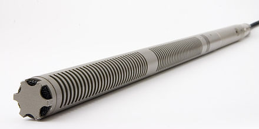
- [Shure Shotgun microphone tutorial](https://www.youtube.com/watch?v=h3LSEnI3ko0)

### Grenzflächenmikrofon (Boundary Microphone)
Ein Grenzflächenmikrofon ist eine Sonderbauform von Mikrofonen, bei denen das Gehäuse Teil des Schallwandlers ist.

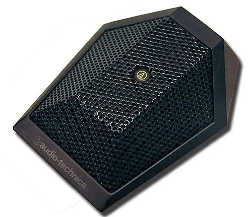

Diese Bauart wurde entwickelt, um die vorteilhaften akustischen Eigenschaften auszunutzen, die an schallreflektierenden Flächen auftreten, ohne das Schallfeld selbst zu beeinträchtigen. Das Mikrofon wird auf eine große schallreflektierende Fläche, z. B. auf den Fußboden, gelegt. Es erhält so den maximalen Schalldruck mit verringerten Raumschallanteilen.

### Elektromagnetische Tonabnehmer (Pickup)

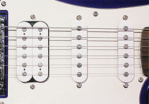

Mittels eines elektromagnetischen Tonabnehmers (engl. Pickup) wird die Saitenschwingung bei einer E-Gitarre, bei einem E-Bass oder bei elektromechanischen E-Pianos in elektrische Signale (Wechselspannung) umgewandelt. Er besteht im einfachsten Fall aus einem Dauermagneten, um den eine Spule gewickelt ist. Die Bewegung der Saiten (sie müssen aus einem ferro-magnetischen Material bestehen) im Magnetfeld ändert dessen Feldstärke. Somit wird in der Spule durch elektromagnetische Induktion eine Wechselspannung mit der Frequenz der Schwingung der Saite erzeugt. Diese Spannung beträgt etwa 0,1 V, was jedoch auch von der Dicke der Saite und ihrer Schwingungsrichtung sowie -amplitude abhängt: Je dicker eine Saite ist, desto höher ist auch die durch sie induzierte Spannung.

#### Inductive Pickup
Für geräusche Musik oder Telekommunikationsüberwachung häufig verwendet.

[Demo mit einem Inductive  Pickup](https://www.youtube.com/watch?v=4T7qkYY7LZM&list=PLyFW-rnLqSeGxwsL0FL160g8y6XmdHZcQ)

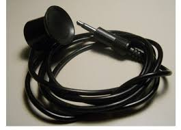

[Auch in Deutschland verfügbar](http://www.henri.de/audiotechnik/mikrofon/tonabnehmer/4757/tonabnehmer-saugnapf-mit-anschlussschnur-3-5mm-klinke.html)

### Piezomikrofon (Piezo microphone)
ist ein elektroakustischer Wandler, der Druckschwankungen in entsprechende elektrische Signale wandelt. Eine Membran folgt den Druckschwankungen. Sie ist mechanisch mit einem piezoelektrischen Element gekoppelt, das durch die Druckschwankungen minimal verformt wird. Die elektrische Spannungsschwankungen des piezoelektrischen Materials (meist Blei-Zirkonat-Titanat) werden zum Verstärker übertragen.

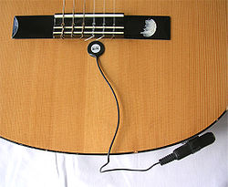

[Nicholas Collings - Experiment mit Piezo ](http://youtu.be/P8iAshJ1Pk0?list=PLyFW-rnLqSeGxwsL0FL160g8y6XmdHZcQ)

[Klangbeispie mit Kontaktmikro](http://youtu.be/FOfEsUTZRK0?t=1m11s)

[Anwendung von Piezo](http://youtu.be/8fXl67zGZlo)

#### Piezoelektrizität (Piezoelectricity)
beschreibt die Änderung der elektrischen Polarisation und somit das Auftreten einer elektrischen Spannung an Festkörpern, wenn sie elastisch verformt werden (direkter Piezoeffekt). Umgekehrt verformen sich Materialien bei Anlegen einer elektrischen Spannung (inverser Piezoeffekt).

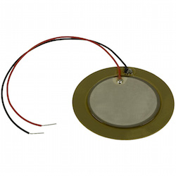

## Bekannte Mikrofonhersteller

- [Schoeps](http://www.schoeps.de/en/home)
  - WDR benutzt Schoeps MK4 - MK5 für Aufnahme
- [AKG](http://www.akg.com/AKG-997.html)
  - Fast alle AufnahmeStudios haben AKG 414
- [Neumann](http://neumannusa.com)
  - Neumann U87i ist Perfekt für Gesang
- [Shure](http://www.shure.de)
  - Meiste Pop-Sänger benutzt SM-58 auf der Bühne
- [Sennheiser](http://en-de.sennheiser.com)
  - MD 421, gut für Schlagzeug
- [Behringer](http://www.behringer.com)
  - Günstig! Gut für dein erstes Mikro.

### Shure SM 57 (Dynamische Mikrofon)
  - Snare Drum, Schlagzeug, E-Gittare u.a.
  - [Snare Drum Demo](http://youtu.be/oDuzGsGdyds?t=59s)
  - [Guitar Amp Demo](http://youtu.be/sb4MQUuq9pE)

### Shure SM 58 (Dynamische Mikrofon)
  - Stimme

[Unterschied zwischen Shure 57 und 58](http://musictechreview.com/shure-sm57-vs-sm58-similarities-differences/)

### AKG 414 (Kondensator Mikrofon)

  - Klavier
  - Becken

### Schoeps MK4 (Kondesnator Mikrfon)

### Neumann U87 (Kondensator / Kugel - Niere- Acht)

- Stimme (Aufnahme)

 

### DPA 4060 (kondensator / Kugel)

- Seiteninstrumente

## Stereomikrofonie

### Lokalisation
Unter Lokalisation versteht man das Erkennen von Richtung und Entfernung einer Schallquelle als Richtungshören und Entfernungshören, also die Richtungslokalisation und die Entfernungslokalisation.

Der Mensch ist in der Lage, seine wahrgenommenen Hörereignisse bestimmten Richtungen zuzuweisen. Der Mensch besitzt Wahrnehmungsmechanismen für die halbe Horizontalebene und die Medianebene. In einem kopfbezogenen Koordinatensystem wird als 0°-Achse die Richtung waagerecht nach vorn definiert.

### Horizontalebene
Sobald die Schallquelle nicht mehr direkt auf der 0°-Achse liegt, kommt es zu interauralen Laufzeitdifferenzen (ITD) und interauralen Pegeldifferenzen (ILD).

#### Laufzeitdifferenz (Interaural Time Difference)
wird in der Akustik beim natürlichen Hören (Richtungshören) als ITD (Interaural Time Difference) und in der Tontechnik als Δ t beim Erzeugen der Hörereignisrichtung als Lautsprechersignale zwischen den Stereo-Lautsprechern verwendet, also auf der Lautsprecherbasis. Die Laufzeitdifferenz wird üblicherweise in Millisekunden (ms) angegeben.

### Pegeldifferenz (Interaural Level Difference)
wird in der Akustik beim natürlichen Hören (Richtungshören) als frequenzabhängiges ILD (Interaural Level Difference) und in der Tontechnik als frequenzneutrales Δ L beim Erzeugen der Hörereignisrichtung als Lautsprechersignale zwischen den Stereo-Lautsprechern verwendet, also auf der Lautsprecherbasis. Die Pegeldifferenz wird üblicherweise in Dezibel (dB) angegeben.

### Medianebene

In der Medianebene gibt es fast keine Laufzeitdifferenzen und Pegeldifferenzen zwischen beiden Ohren. Zur Lokalisation eines Schallereignisses werden hier die akustischen Eigenschaften des Außenohres ausgenutzt.

Die unterschiedlichen Erhebungen und Vertiefungen der Ohrmuschel bilden zusammen mit dem Gehörgang ein akustisches Resonatorsystem, das je nachdem, ob der Schall von vorn, von oben oder von hinten eintrifft, unterschiedlich angeregt wird. Hierdurch entstehen richtungsabhängige Minima und Maxima im Frequenzgang der Ohrempfindlichkeit. Das dadurch klanglich veränderte Geräusch wird vom Gehör in der Medianebene lokalisiert und klanglich korrigiert.

#### HRTF
Die Head-Related Transfer Function beschreibt die komplexe Filterwirkung von Kopf, Außenohr (Pinna) und Rumpf. Diese Amplituden-Auswertung ist neben den Laufzeitdifferenzen zwischen den Ohren wesentliche Grundlage unseres akustischen Lokalisationssystems.

[HRTF Demo](https://www.youtube.com/watch?v=3b5J1OaP3pU)

### XY
Die XY-Stereofonie ist ein Stereo- Mikrofonierungsverfahren für die Lautsprecherstereofonie. Es arbeitet nur mit Pegeldifferenzen zwischen den Kanälen Links und Rechts. Zwei gerichtete Einzelmikrofone werden dabei in möglichst geringem Membranabstand vertikal übereinander als Hauptmikrofonsystem angeordnet. Die Pegeldifferenzen ergeben sich durch die Richtwirkung der nach außen gedrehten Mikrofone. Somit gibt es nur Interchannel-Pegeldifferenz und keine Interchannel-Laufzeitdifferenz.

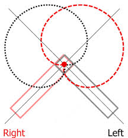
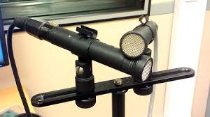

### AB
Die AB Stereophonie platziert zwei völlig getrennte Mikrophone mit großem räumlichem Abstand voneinander vor der Schallquelle. Die Ortung auf der Stereobasis beruht bei diesem Verfahren in erster Linie auf der Laufzeit des Schalls zwischen den beiden Mikrophonen und nur in zweiter Linie auf der unterschiedlichen Intensität. Mit der Laufzeit-Stereophonie ergeben sich ohne große Mühe bei der Aufstellung sehr räumliche klingende Aufnahmen.

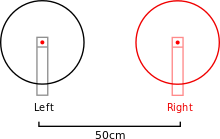
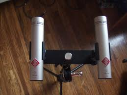

### ORTF
Bei der ORTF-Stereophonie (Office de Radiodiffusion Télévision Française) werden nun beide Stereo-Techniken (AB und XY) miteinander kombiniert. Hierfür werden zwei Nieren-Mikrofone in einem Abstand von 17 cm und einem Winkel von 110° zueinander aufgestellt. Dadurch wird sowohl ein Laufzeit- als auch ein Intensitätsunterschied erzielt - was schon recht nahe an das natürliche Stereoempfinden herankommt.

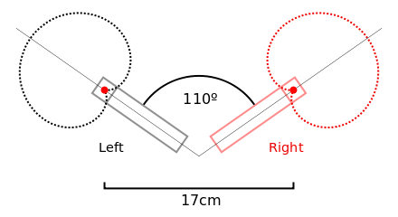

[Visualisierung Stereofpnnie](http://www.sengpielaudio.com/Visualization-XY90.htm)

### M/S (Mid-Side)
ist ein stereofones Signalkodierungsverfahren. Dabei werden die Stereokanäle nicht nach den herkömmlichen Kanälen Links L und Rechts R, sondern nach Mitte-Kanal M und Seite-Kanal S getrennt.

MS-Signale können durch Summenbildung (Mittenkanal M) und Differenzbildung (Seitenkanal S) der Links- und Rechts-Kanäle gewonnen werden: Der Mitte-Kanal führt die auf den üblichen Kanälen Links-Rechts identischen, der Seite-Kanal die unterschiedlichen Signalanteile. Umgekehrt lassen sich MS-Kanäle in LR-Kanäle umwandeln, so dass sie auf den gängigen Stereo-Lautsprechersystemen wiedergegeben werden können:

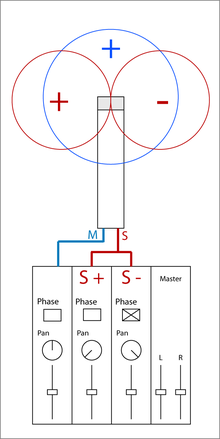
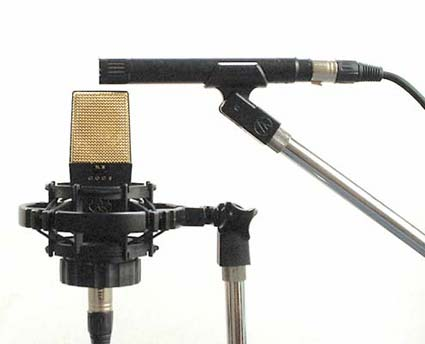

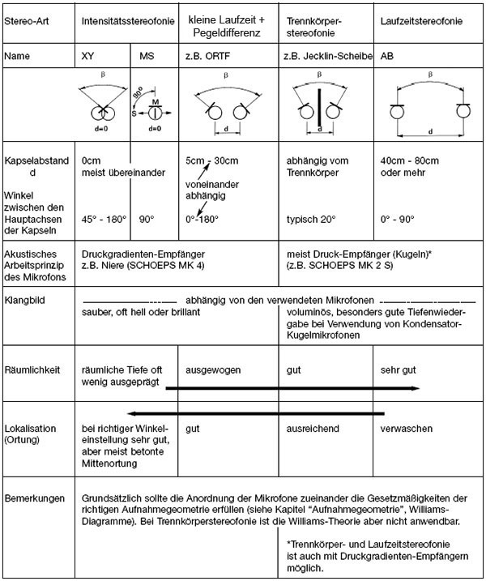
[Quelle]( http://www.ingwu.de/index.php?option=com_content&view=article&id=46%3A01-grundlagen-von-mikrofonen-und-stereoaufnahmen&catid=34%3Amikrofonaufsaetze)

### Binaurale Aufnahme
 ist eine Aufnahme von Schallsignalen mit Mikrofonen, die bei der Wiedergabe nur über Kopfhörer einen natürlichen Höreindruck mit genauer Richtungslokalisation erzeugen sollen. Bei der Aufnahme in Kunstkopfstereofonie wird häufig ein Kunstkopf verwendet.

#### Kunstkopf (dummy head)

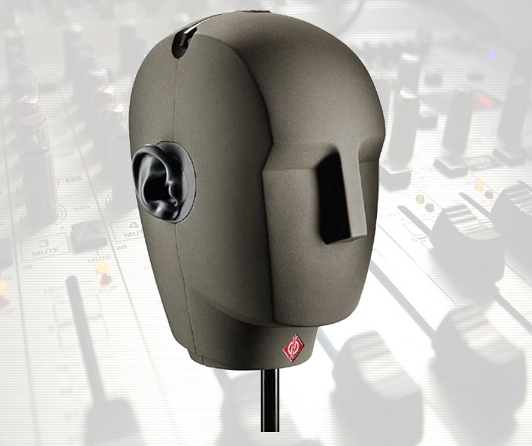

[Virtual Barbershop](https://www.youtube.com/watch?v=IUDTlvagjJA)

#### Binaurales Mikrofon

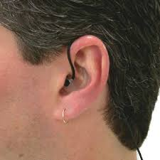

### Digitaler Audio-Rekorder
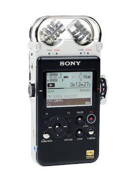

Portabler digitaler Audio-Rekorder sind heute meist mit Flash-Speicher und Speicherkarten ausgestattet, sind batteriebetrieben, haben meist eingebaute Mikrophone und werden teilweise auch als Field Recorder bezeichnet. In der Regel verfügen sie auch über einen Kopfhörerausgang und einen USB-Anschluss, so dass sie auch als MP3-Spieler und im Zusammenhang mit Computern eingesetzt werden können.

1. Lokalisation
2. Laufzeitdifferenz (ITD)
3. Pegeldifferenz (ILD)
4. XY
5. AB
6. ORTF
7. MS
8. Binaurale Aufnahme
9. Kunstkopf
10. Binaurales Mikrofon
11. Head Related Transfer Function
12. Digitaler Audio-rekorder
13. Richtrohrmikrofon
14. Grenzflächenmikrofon
15. Elektromagnetische Tonabnehmer
16. Piezomikrofon
17. Piezoelektrizität
