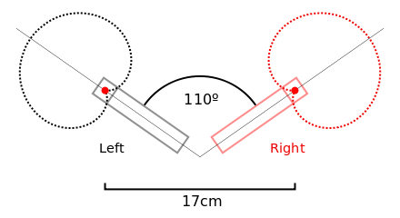
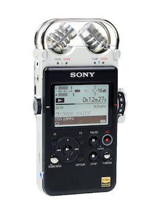

# Klasse 9
# Mirofon 2

## Stereomikrofon

### XY
Die XY-Stereofonie ist ein Stereo- Mikrofonierungsverfahren für die Lautsprecherstereofonie. Es arbeitet nur mit Pegeldifferenzen zwischen den Kanälen Links und Rechts. Zwei gerichtete Einzelmikrofone werden dabei in möglichst geringem Membranabstand vertikal übereinander als Hauptmikrofonsystem angeordnet. Die Pegeldifferenzen ergeben sich durch die Richtwirkung der nach außen gedrehten Mikrofone. Somit gibt es nur Interchannel-Pegeldifferenz und keine Interchannel-Laufzeitdifferenz.

### AB
Die AB Stereophonie platziert zwei völlig getrennte Mikrophone mit großem räumlichem Abstand voneinander vor der Schallquelle. Die Ortung auf der Stereobasis beruht bei diesem Verfahren in erster Linie auf der Laufzeit des Schalls zwischen den beiden Mikrophonen und nur in zweiter Linie auf der unterschiedlichen Intensität. Mit der Laufzeit-Stereophonie ergeben sich ohne große Mühe bei der Aufstellung sehr räumliche klingende Aufnahmen.

### ORTF
Bei der ORTF-Stereophonie (Office de Radiodiffusion Télévision Française) werden nun beide Stereo-Techniken (AB und XY) miteinander kombiniert. Hierfür werden zwei Nieren-Mikrofone in einem Abstand von 17 cm und einem Winkel von 110° zueinander aufgestellt. Dadurch wird sowohl ein Laufzeit- als auch ein Intensitätsunterschied erzielt - was schon recht nahe an das natürliche Stereoempfinden herankommt.

[Visualisierung Stereofpnnie](http://www.sengpielaudio.com/Visualization-XY90.htm)

### Digitaler Audio-Rekorder

Portabler digitaler Audio-Rekorder sind heute meist mit Flash-Speicher und Speicherkarten ausgestattet, sind batteriebetrieben, haben meist eingebaute Mikrophone und werden teilweise auch als Field Recorder bezeichnet. In der Regel verfügen sie auch über einen Kopfhörerausgang und einen USB-Anschluss, so dass sie auch als MP3-Spieler und im Zusammenhang mit Computern eingesetzt werden können.

1. XY
2. AB
3. ORTF
4.
5. Digitaler Audio-rekorder
6.
7.
8.
9.
10.
11.
12.
13.
14.
15.
16.
17.
18.
19.
20.
