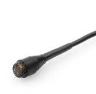

# Klasse 9
# Mikrofon 2

## Mikrofonhersteller

- [Schoeps](http://www.schoeps.de/en/home)
  - WDR benutzt Schoeps MK4 - MK5 für Aufnahme
- [AKG](http://www.akg.com/AKG-997.html)
  - Fast alle AufnahmeStudios haben AKG 414
- [Neumann](http://neumannusa.com)
  - Neumann U87i ist Perfekt für Gesang
- [Shure](http://www.shure.de)
  - Meiste Pop-Sänger benutzt SM-58 auf der Bühne
- [Sennheiser](http://en-de.sennheiser.com)
  - MD 421, gut für Schlagzeug
- [Behringer](http://www.behringer.com)
  - Günstig! Gut für dein erstes Mikro.

## Die Mikrofone, die alle auswendig lernen muss

### Shure SM 57 (Dynamische Mikrofon)
  - Snare Drum, Schlagzeug, E-Gittare u.a.
  - [Snare Drum Demo](http://youtu.be/oDuzGsGdyds?t=59s)
  - [Guitar Amp Demo](http://youtu.be/sb4MQUuq9pE)

### Shure SM 58 (Dynamische Mikrofon)
  - Stimme

[Unterschied zwischen Shure 57 und 58](http://musictechreview.com/shure-sm57-vs-sm58-similarities-differences/)

### AKG 414 (Kondensator Mikrofon)

  - Klavier
  - Becken

### Schoeps MK4 (Kondesnator Mikrfon)

### Neumann U87 (Kondensator / Kugel - Niere- Acht)

- Stimme (Aufnahme)

 

### DPA 4060 (kondensator / Kugel)

- Seiteninstrumente

## Stereomikrofon

### Lokalisation
Unter Lokalisation versteht man das Erkennen von Richtung und Entfernung einer Schallquelle als Richtungshören und Entfernungshören, also die Richtungslokalisation und die Entfernungslokalisation.

### Laufzeitdifferenz (Interaural Time Difference)
wird in der Akustik beim natürlichen Hören (Richtungshören) als ITD (Interaural Time Difference) und in der Tontechnik als Δ t beim Erzeugen der Hörereignisrichtung als Lautsprechersignale zwischen den Stereo-Lautsprechern verwendet, also auf der Lautsprecherbasis. Die Laufzeitdifferenz wird üblicherweise in Millisekunden (ms) angegeben.

### Pegeldifferenz (Interaural Level Difference)
wird in der Akustik beim natürlichen Hören (Richtungshören) als frequenzabhängiges ILD (Interaural Level Difference) und in der Tontechnik als frequenzneutrales Δ L beim Erzeugen der Hörereignisrichtung als Lautsprechersignale zwischen den Stereo-Lautsprechern verwendet, also auf der Lautsprecherbasis. Die Pegeldifferenz wird üblicherweise in Dezibel (dB) angegeben.

### XY
Die XY-Stereofonie ist ein Stereo- Mikrofonierungsverfahren für die Lautsprecherstereofonie. Es arbeitet nur mit Pegeldifferenzen zwischen den Kanälen Links und Rechts. Zwei gerichtete Einzelmikrofone werden dabei in möglichst geringem Membranabstand vertikal übereinander als Hauptmikrofonsystem angeordnet. Die Pegeldifferenzen ergeben sich durch die Richtwirkung der nach außen gedrehten Mikrofone. Somit gibt es nur Interchannel-Pegeldifferenz und keine Interchannel-Laufzeitdifferenz.

### AB
Die AB Stereophonie platziert zwei völlig getrennte Mikrophone mit großem räumlichem Abstand voneinander vor der Schallquelle. Die Ortung auf der Stereobasis beruht bei diesem Verfahren in erster Linie auf der Laufzeit des Schalls zwischen den beiden Mikrophonen und nur in zweiter Linie auf der unterschiedlichen Intensität. Mit der Laufzeit-Stereophonie ergeben sich ohne große Mühe bei der Aufstellung sehr räumliche klingende Aufnahmen.

### ORTF
Bei der ORTF-Stereophonie (Office de Radiodiffusion Télévision Française) werden nun beide Stereo-Techniken (AB und XY) miteinander kombiniert. Hierfür werden zwei Nieren-Mikrofone in einem Abstand von 17 cm und einem Winkel von 110° zueinander aufgestellt. Dadurch wird sowohl ein Laufzeit- als auch ein Intensitätsunterschied erzielt - was schon recht nahe an das natürliche Stereoempfinden herankommt.

[Visualisierung Stereofpnnie](http://www.sengpielaudio.com/Visualization-XY90.htm)

### Digitaler Audio-Rekorder

Portabler digitaler Audio-Rekorder sind heute meist mit Flash-Speicher und Speicherkarten ausgestattet, sind batteriebetrieben, haben meist eingebaute Mikrophone und werden teilweise auch als Field Recorder bezeichnet. In der Regel verfügen sie auch über einen Kopfhörerausgang und einen USB-Anschluss, so dass sie auch als MP3-Spieler und im Zusammenhang mit Computern eingesetzt werden können.

## Multikanal
## Stereofonie

## Quadrafonie

## Oktofonie

## 5.1

1. Lokalisation
2. Laufzeitdifferenz
3. Pegeldifferenz
4. XY
5. AB
6. ORTF
7. Digitaler Audio-rekorder
8.
9.
10.
11.
12.
13.
14.
15.
16.
17.
18.
19.
20.
